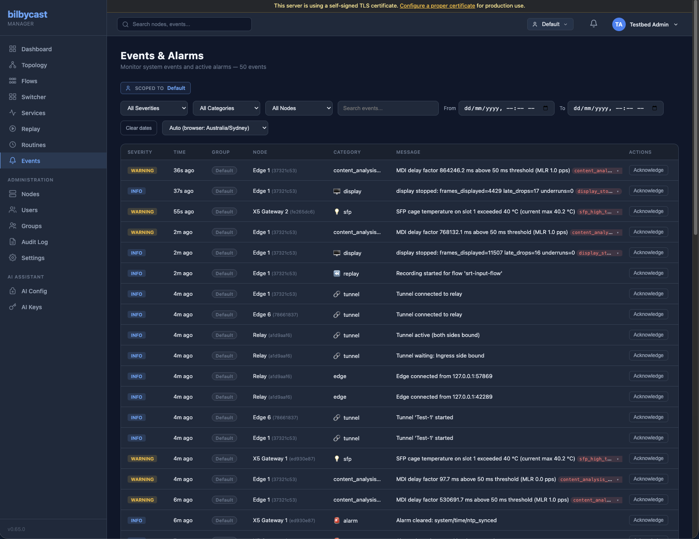

bilbycast-edge generates operational events and forwards them to bilbycast-manager via WebSocket. Events provide real-time visibility into connection state changes, failures, and significant operational conditions that go beyond periodic stats and health messages.



## Event Protocol

Events are sent as WebSocket messages with type `"event"`:

```json
{
  "type": "event",
  "timestamp": "2026-04-02T12:00:00Z",
  "payload": {
    "severity": "warning",
    "category": "srt",
    "message": "SRT input disconnected, reconnecting",
    "flow_id": "flow-1",
    "details": { ... }
  }
}
```

### Severity Levels

| Severity | Meaning | Action |
|----------|---------|--------|
| `critical` | Service-impacting failure | Operator should investigate immediately |
| `warning` | Degradation or potential issue | Operator should investigate when possible |
| `info` | Notable state change | No action required, operational awareness |

### Event Fields

| Field | Type | Required | Description |
|-------|------|----------|-------------|
| `severity` | string | yes | `"info"`, `"warning"`, or `"critical"` |
| `category` | string | yes | Event category (see tables below) |
| `message` | string | yes | Human-readable description |
| `flow_id` | string | no | Associated flow or tunnel ID |
| `details` | object | no | Structured context (error codes, peer addresses, etc.) |

### Deduplication

Events are emitted on state transitions, not periodically. For example, an SRT disconnect event fires once when the connection drops, not repeatedly while disconnected. The corresponding reconnection event fires when the connection is restored.

For protocols with automatic reconnection loops (RTSP, SRT caller), disconnect events fire **once per connection cycle** — if the remote is unreachable and retries continue, subsequent retry failures are silent until a connection succeeds and then drops again.

### Buffering

Events are queued in an unbounded in-memory channel. When the edge is not connected to the manager (e.g., during reconnection), events accumulate and are delivered once the connection is re-established.

---

## Event Reference

### Flow Lifecycle (`flow`)

| Severity | Message | Trigger |
|----------|---------|---------|
| info | Flow '{id}' started | Flow successfully created and running |
| info | Flow '{id}' stopped | Flow stopped by command or config change |
| critical | Flow '{id}' failed to start: {error} | Flow startup error (input bind, output bind, validation) |
| critical | Flow input lost: {error} | Input task exited unexpectedly |
| info | Output '{id}' added to flow '{flow_id}' | Hot-add output succeeded |
| info | Output '{id}' removed from flow '{flow_id}' | Hot-remove output succeeded |
| warning | Output '{id}' failed to start on flow '{flow_id}': {error} | Output startup failure within a running flow |

**Source**: `src/engine/manager.rs`, `src/engine/input_srt.rs`

---

### Bandwidth (`bandwidth`)

| Severity | Message | Trigger | Details |
|----------|---------|---------|---------|
| warning | Flow '{id}' bandwidth exceeded limit ({current} Mbps > {limit} Mbps) | Input bitrate exceeds configured `bandwidth_limit.max_bitrate_mbps` for the grace period (alarm action) | `{ current_mbps, limit_mbps, action: "alarm" }` |
| critical | Flow '{id}' blocked: bandwidth exceeded limit ({current} Mbps > {limit} Mbps) | Input bitrate exceeds configured limit for the grace period (block action) — packets dropped until bandwidth normalizes | `{ current_mbps, limit_mbps, action: "block" }` |
| info | Flow '{id}' bandwidth returned to normal, unblocked | Bitrate returned within limits after being blocked — flow resumes | `{ current_mbps, limit_mbps }` |
| info | Flow '{id}' bandwidth returned to normal ({current} Mbps <= {limit} Mbps) | Bitrate returned within limits after alarm | `{ current_mbps, limit_mbps }` |

**Source**: `src/engine/bandwidth_monitor.rs`

---

### SRT (`srt`)

#### SRT Input

| Severity | Message | Trigger |
|----------|---------|---------|
| info | SRT input connected (mode=listener) | Listener accepted a caller connection |
| info | SRT input connected (mode={mode}) | Caller connected to remote |
| info | SRT input connected (mode=listener, redundant leg 1) | Redundant leg 1 accepted |
| warning | SRT input disconnected, reconnecting | Peer disconnected, reconnection in progress |
| critical | SRT input connection failed: {error} | Listener accept or caller connect failed |

#### SRT Output

| Severity | Message | Trigger |
|----------|---------|---------|
| info | SRT output '{id}' connected | Peer connected (listener) or caller connected |
| warning | SRT output '{id}' disconnected | Peer disconnected or connection lost |
| warning | SRT output '{id}' stale connection detected | No ACK received after timeout, re-accepting |
| critical | SRT output '{id}' connection failed: {error} | Caller can't reach remote, or bind fails |

**Source**: `src/engine/input_srt.rs`, `src/engine/output_srt.rs`

---

### SMPTE 2022-7 Redundancy (`redundancy`)

| Severity | Message | Trigger |
|----------|---------|---------|
| warning | Redundant leg 1 lost | SRT redundant leg 1 stopped receiving |
| warning | Redundant leg 2 lost | SRT redundant leg 2 stopped receiving |
| critical | Both redundant legs lost | No data from either leg, will reconnect |

**Source**: `src/engine/input_srt.rs`

---

### RTMP (`rtmp`)

| Severity | Message | Trigger |
|----------|---------|---------|
| info | RTMP publisher connected | Client connected and started publishing |
| warning | RTMP publisher disconnected | Publisher disconnected |
| critical | RTMP server error: {error} | Server bind or accept failure |

**Source**: `src/engine/input_rtmp.rs`

---

### RTSP (`rtsp`)

| Severity | Message | Trigger |
|----------|---------|---------|
| info | RTSP connected to {url} | RTSP DESCRIBE/SETUP/PLAY succeeded |
| warning | RTSP input disconnected: {error}. Reconnecting in {n}s | Stream lost after a successful connection |

The disconnect event fires **once per connection cycle** — if the RTSP server is unreachable and the edge retries repeatedly, only the first failure emits an event. A new "connected" event followed by a new "disconnected" event will fire when the connection is established and then lost again.

**Source**: `src/engine/input_rtsp.rs`

---

### HLS (`hls`)

| Severity | Message | Trigger |
|----------|---------|---------|
| warning | HLS segment upload failed: {error} | HTTP PUT fails for a segment |
| critical | HLS output failed: {error} | Output task exited with error |

**Source**: `src/engine/output_hls.rs`

---

### RTP Input (`rtp`)

| Severity | Message | Trigger |
|----------|---------|---------|
| info | RTP input listening on {addr} | UDP socket successfully bound |
| critical | RTP input bind failed: {error} | Bind failed (port in use, permission denied) |

For redundant RTP inputs, each leg emits its own bind event with a `leg` field in details.

**Source**: `src/engine/input_rtp.rs`

---

### UDP Input (`udp`)

| Severity | Message | Trigger |
|----------|---------|---------|
| info | UDP input listening on {addr} | UDP socket successfully bound |
| critical | UDP input bind failed: {error} | Bind failed (port in use, permission denied) |

**Source**: `src/engine/input_udp.rs`

---

### RIST (`rist`)

RIST Simple Profile (always compiled in — no feature flag) input and output connection lifecycle.

| Severity | Message | Trigger |
|----------|---------|---------|
| info | RIST input listening on {addr} | Input socket bound |
| critical | RIST input lost: {error} | Input task exited unexpectedly |
| info | RIST output '{id}' connected -> {remote} | Output established its RIST session |
| critical | RIST output '{id}' exited with error: {error} | Output task exited unexpectedly |

Bind failures surface under the unified `port_conflict` / `bind_failed` categories.

**Source**: `src/engine/input_rist.rs`, `src/engine/output_rist.rs`

---

### WebRTC (`webrtc`)

| Severity | Message | Trigger |
|----------|---------|---------|
| info | WHIP publisher connected | ICE+DTLS complete on WHIP server input |
| info | WHIP publisher disconnected | Publisher left |
| info | WHEP connected | WHEP client input connected to remote |
| info | WHEP disconnected | WHEP client input disconnected |
| info | WHEP viewer connected | New WHEP viewer joined an output |
| info | WHEP viewer disconnected | WHEP viewer left an output |
| warning | WebRTC session failed: {error} | ICE failure, DTLS error, or session creation error |
| warning | WebRTC session creation failed: {error} | Output session could not be created |

**Source**: `src/engine/input_webrtc.rs`, `src/engine/output_webrtc.rs`

---

### Audio Encoder (`audio_encode`)

ffmpeg-sidecar audio encoder lifecycle for the Phase B compressed-audio egress on RTMP, HLS, and WebRTC outputs. Emitted by the per-output build helpers (`output_rtmp::build_encoder_state`, `output_hls::hls_output_loop` startup gate, `output_webrtc::build_webrtc_encoder_state`) and the long-running encoder supervisor (`engine::audio_encode::supervisor_loop`).

| Severity | Message | Trigger |
|----------|---------|---------|
| info | audio encoder started: output '{id}' codec={codec} {N} kbps | First successful ffmpeg spawn for an RTMP/WebRTC output, or HLS startup with `audio_encode` set. Details payload: `{ output_id, codec, bitrate_kbps, sample_rate, channels }` |
| warning | audio encoder restarted: output '{id}' restart {N}/{max} | Supervisor restarted ffmpeg after a crash. Details payload: `{ output_id, restart_count, max_restarts }` |
| warning | HLS output '{id}': segment {n} remux failed: {error} | Per-segment ffmpeg fork failed on a single HLS segment. The next segment may succeed |
| critical | audio encoder failed: output '{id}' exhausted {N} restarts in {S} s | Supervisor gave up after MAX_RESTARTS in RESTART_WINDOW |
| critical | RTMP/HLS/WebRTC output '{id}': audio_encode requires ffmpeg in PATH but it is not installed | ffmpeg missing at lazy-build time |
| critical | output '{id}': audio_encode requires AAC-LC input ... got profile={p} | Phase A `AacDecoder` rejected the source AAC profile (HE-AAC, AAC-Main, multichannel, etc.) |
| critical | output '{id}': audio_encode is set but the flow input cannot carry TS audio (PCM-only source) | `compressed_audio_input` is false (e.g. ST 2110-30, `rtp_audio` input) |
| critical | output '{id}': audio_encode encoder spawn failed: {error} | `AudioEncoder::spawn` failed for any other reason (codec rejected by ffmpeg, etc.) |

**Source**: `src/engine/audio_encode.rs`, `src/engine/output_rtmp.rs`, `src/engine/output_hls.rs`, `src/engine/output_webrtc.rs`.

---

### Video Encoder (`video_encode`)

In-process video transcoding lifecycle for TS outputs (SRT, RIST, RTP, UDP) and video-encode inputs.

| Severity | Message | Trigger | Details |
|----------|---------|---------|---------|
| info | Video encoder started: output '{id}' | `TsVideoReplacer` created successfully | `{ codec }` |
| critical | Video encoder failed: output '{id}': {error} | `TsVideoReplacer` construction rejected (missing feature, unsupported codec) | `{ error }` |
| warning | Output/Input '{id}': the video transcoder is consuming input but producing no decoded frames | Decode-stall watchdog: ≥ 200 input frames consumed with zero decoded output (e.g. a HW decode backend that opened but fails every frame). One-shot, re-armed on recovery | `{ error_code: "video_transcode_decode_stalled", input_frames, output_frames, decode_errors, source_stream_type }` |

**Source**: `src/engine/ts_video_replace.rs`, output modules (`output_srt.rs`, `output_rist.rs`, `output_rtp.rs`, `output_udp.rs`).

---

### Master Clock (`master_clock`)

PLL lock-state transitions for flows whose master clock runs the source-PCR PLL (`master_clock.kind = contribution` / `source_pcr_pll`, or the `auto` cascade's PLL rung).

| Severity | Message | Trigger | Details |
|----------|---------|---------|---------|
| warning | PCR PLL did not lock within {n}s on flow '{id}'; falling back to wallclock | The PLL failed to lock within the grace window (`pll_lock_timeout_s`, default 30 s) — the master clock drops to the wallclock rung; output PCR is bounded but no longer tracks the source | `{ error_code: "master_clock_pll_fallback", input_id, samples_received, samples_needed, p99_jitter_us, fallback_reason }` |
| info | PCR PLL re-acquired lock on flow '{id}'; leaving wallclock fallback | The PLL converged again after a prior fallback and self-healed back to the PLL rung | `{ error_code: "master_clock_pll_recovered", input_id, samples_received, p99_jitter_us }` |

**Source**: `src/engine/master_clock.rs`

---

### Tunnel (`tunnel`)

| Severity | Message | Trigger |
|----------|---------|---------|
| info | Tunnel '{name}' started | Tunnel created and connecting |
| info | Tunnel '{name}' stopped | Tunnel stopped by command or config change |
| info | Tunnel connected to relay | QUIC connection established and TunnelReady received |
| warning | Tunnel disconnected from relay: {reason} | QUIC connection lost or forwarder exited |
| warning | Tunnel peer disconnected: {reason} | Relay reported peer unbound (TunnelDown) |
| warning | Tunnel connection to relay failed: {error} | QUIC connect or TLS error |
| critical | Tunnel '{name}' failed: {error} | Tunnel task exited with fatal error |
| critical | Tunnel bind rejected by relay: {reason} | HMAC bind token verification failed |

**Source**: `src/tunnel/manager.rs`, `src/tunnel/relay_client.rs`

---

### Manager Connection (`manager`)

| Severity | Message | Trigger |
|----------|---------|---------|
| info | Connected to manager | WebSocket auth succeeded |
| warning | Manager connection lost, reconnecting | WebSocket closed or errored |
| critical | Manager authentication failed: {reason} | Auth rejected by manager |

**Source**: `src/manager/client.rs`

---

### Configuration (`config`)

| Severity | Message | Trigger |
|----------|---------|---------|
| info | Configuration updated | Config applied via manager command |
| warning | Failed to persist configuration: {error} | Config write to disk failed after update |

Two codes in this category carry a structured `details` payload:

| Error code | Severity | Trigger | Details payload |
|---|---|---|---|
| `deprecated_env_var` | warning | The node's environment (usually its systemd unit) sets a `BILBYCAST_*` variable that has moved into configuration. One event per stale variable, raised at startup — the queue flushes on the first manager auth, so it reaches the Events page even though it is raised before the WebSocket connects. This is the only signal an operator gets that a unit-file variable is doing nothing. | `{ error_code, env_var, replacement, status, value }`. `status` is `"deprecated"` (still honoured, but *below* the config field that replaced it), `"removed"` (does nothing at all) or `"unparseable"` (still read, but this host's value could not be parsed, so it was discarded and the layer below answered). |
| `tuning_requires_restart` | warning | A pushed `tuning` field was accepted but is read once at node start, so it takes effect at the node's next restart rather than on the push. | `{ error_code, fields }`, where `fields` is `["tuning.probe_session_limits", "tuning.probe_4k"]` — the only two knobs affected. The other four `tuning` knobs — the two ingress de-jitter defaults and the two media-player defaults — are re-installed on the push without a node restart, but they are read when an input spawns: an input that is already running keeps its current behaviour until it respawns, so a **flow** restart is what applies them. |

**Source**: `src/manager/client.rs`, `src/main.rs`, `src/config/env_compat.rs`

---

### PID Bus / Flow Assembly (`flow`)

Errors generated while bringing up or hot-swapping an assembled flow (`assembly.kind = spts | mpts`). All `pid_bus_*` codes are emitted as **Critical** events with a structured `details` payload (`error_code`, `input_id`, `input_type`, `program_number`, …) and the same `error_code` rides on the corresponding `command_ack.error_code` — so the manager UI can highlight the offending field on Create/Update modals without parsing the error string. See [Flow Assembly (PID Bus)](/edge/flow-assembly/).

| Error code | Trigger | Details payload | Remediation |
|---|---|---|---|
| `pid_bus_spts_input_needs_audio_encode` | A referenced input could produce TS via input-level `audio_encode` but isn't configured. | `{ input_id, input_type }` | Set `audio_encode.codec = "aac_lc"` (or HE-AAC / `s302m`) on the input. ST 2110-31 must use `s302m`. |
| `pid_bus_audio_encode_codec_not_supported_on_input` | `audio_encode.codec` validates but has no runtime path on the decoded-ES cache yet (today: `mp2`, `ac3`). | `{ input_id, input_type }` | First-light codecs: `aac_lc`, `he_aac_v1`, `he_aac_v2`, `s302m`. `mp2` / `ac3` deferred. |
| `pid_bus_spts_non_ts_input` | Referenced input has no current path to TS (e.g. ST 2110-40 ANC). | `{ input_id, input_type }` | ST 2110-40 ANC-to-TS wrapping is deferred. |
| `pid_bus_no_program` | `assembly.kind = spts/mpts` but `programs` is empty. | `{}` | Should not normally reach runtime — config validation catches this earlier. |
| `pid_bus_essence_kind_not_implemented` | `SlotSource::Essence` with a `kind` the resolver can't yet satisfy. | `{ input_id, kind }` | First-light supports `video` and `audio`; `subtitle` / `data` under development. |
| `pid_bus_essence_no_catalogue` | Essence slot but the named input has no PSI catalogue yet (non-TS input or ingress not warm). | `{ input_id }` | Switch to a `SlotSource::Pid` slot, or wait for PSI; re-try with `UpdateFlowAssembly`. |
| `pid_bus_essence_no_match` | Essence slot of kind X, but no matching ES found in the input's PMT. | `{ input_id, kind }` | Check the input's live PSI catalogue in the manager UI. |
| `pid_bus_spts_stream_type_mismatch` | Warning logged when a slot's configured `stream_type` doesn't match the source PMT's declared `stream_type`. | `{ input_id, source_pid, configured, observed }` | Non-fatal — the slot still forwards bytes. Fix the `stream_type` on the slot to match the upstream PMT. |
| `pid_bus_hitless_leg_not_pid` | A `SlotSource::Hitless` leg is neither `Pid` nor `Essence`. | `{ program_number, leg: "primary" \| "backup" }` | Nested Hitless is rejected at config-save time; this fires only if a follow-up variant slips past validation. |
| `pid_bus_mpts_pcr_source_required` | MPTS program has no effective PCR (neither program-level `pcr_source` nor flow-level fallback). | `{ program_number }` | Config validation also catches this — runtime check is a belt-and-braces guard. |
| `pid_bus_pcr_source_unresolved` | Configured `pcr_source` `(input_id, pid)` doesn't hit any slot in its program (or an Essence-slot's input). | `{ input_id, pid, program_number }` | Make sure the PCR PID is one of the PIDs you're carrying into the program. |

The multiviewer compositor emits under the same `flow` category. It is gated on the `multiviewer` Cargo feature, which every published release artefact carries — see [Multiviewer](/edge/multiviewer/).

| Error code | Severity | Trigger | Details payload |
|---|---|---|---|
| `mosaic_failed` | critical | The wall's compositor task exited with an error; the mosaic input has stopped. | `{ error_code, input_id }` |
| `mosaic_tile_source_missing` | warning | A tile names a node-local input that is not running yet. The tile is **not** abandoned — the task owns subscription and retries, so the tile lights up when the source appears. Starting a wall alongside the feeds it watches is the common case, so this event on wall start is usually benign. | `{ error_code, input_id, tile_id, source_input_id }` |
| `mosaic_tile_self_reference` | warning | A tile names the wall's own input id. The tile is left unassigned (rendering it would be an infinite feedback loop); the rest of the wall runs. | `{ error_code, input_id, tile_id }` |

**Source**: `src/engine/flow.rs`, `src/engine/ts_assembler.rs`, `src/engine/ts_es_hitless.rs`, `src/engine/input_pcm_encode.rs`, `src/engine/input_mosaic.rs`.

---

### Display (`display`)

The local-display output (Linux-only, `display` Cargo feature) emits events under category `display`. Every failure event sets `details.error_code` for `command_ack` correlation, plus `details.output_id` so the manager UI attributes the failure to the offending output row on a multi-output flow. Two sub-families are filed under other categories — the hardware-decode lifecycle under `system_resources` and the input-switch pair under `flow` — so filter the Events page by `error_code` rather than by category when chasing a display fault.

| Event | Severity | Trigger |
|---|---|---|
| `display_started` | info | Modeset succeeded, ALSA opened (or muted), first frame queued. |
| `display_stopped` | info | Cancellation token fired. Includes lifetime `frames_displayed`, `frames_dropped_late`, `audio_underruns`. |
| `display_device_unavailable` | critical | KMS connector vanished mid-flow (cable unplug). |
| `display_mode_set_failed` | critical | `drmModeSetCrtc` returned `EINVAL` / `ENOSPC` for the chosen resolution / refresh. |
| `display_audio_open_failed` | critical | `snd_pcm_open` returned non-zero, or ALSA `writei` returned `ENODEV` mid-stream. |
| `display_decoder_overload` | — | **Never implemented.** Described historically as `frames_dropped_late` above 5 % over a 5-second window, but no emitter exists — it cannot fire, so do not alarm on it. Read `frames_dropped_late` and the frame-loss events below instead. |
| `display_av_drift` | — | **Never implemented.** No emitter exists for it. Live A/V offset is reported continuously as `av_sync_offset_ms`, which the manager polls rather than waiting to be told about. |
| `display_subscriber_lagged` | warning | broadcast `Lagged(n)`; rate-limited to one event / second. |
| `display_deinterlace_engaged` | info | An interlaced source was detected; bob deinterlacing engaged, fields presented at 2× frame rate. Details carry `width`, `height`, `top_field_first`. |
| `display_frame_loss_sustained` | warning | The output presented materially fewer frames than the panel could have shown over the measurement window. Details carry `panel_refresh_hz`, `frames_displayed`, `frames_presentable`, `present_shortfall_pct`, `frames_dropped_mpsc_full` and `window_seconds` — the evidence needed to tell decode-side shedding from present-side stutter. |
| `display_frame_loss_recovered` | info | The shortfall cleared. |
| `display_input_switch_acquiring` | info | *(category `flow`)* A Take was detected on the flow; the output is waiting for the new source's first IDR. |
| `display_input_switch_acquired` | info | *(category `flow`)* The new source is on the panel. Details carry `elapsed_ms`. |
| `display_hw_decode_unavailable` | warning | *(category `system_resources`)* The requested HW backend could not be opened on this host after 3 attempts; the output ran on CPU decode instead, and `decoder_kind` reports `"cpu (hw unavailable)"`. Details carry `requested_backend`, `fell_back_to`, `attempts`, `last_error`. |
| `display_hw_decode_runtime_failed` | warning | *(category `system_resources`)* A HW decoder that had opened successfully failed mid-stream; the output demoted to CPU. Details carry `trigger` and `last_error`. |
| `display_hw_decode_no_frames` | warning | *(category `system_resources`)* The HW decoder accepted packets but produced no frame inside the watchdog window; the output demoted to CPU. Details carry `backend` and `ms_since_first_send`. |
| `display_hw_decode_repromote` | info | *(category `system_resources`)* A previously demoted output is retrying the hardware decoder after a spell on CPU. Details carry `backend`, `attempt`, `cpu_seconds`. |

Save-time `command_ack.error_code` values: `display_device_invalid`, `display_audio_device_invalid`, `display_resolution_unsupported`, `display_program_not_found`, `display_audio_track_not_found`, `display_device_busy`, `display_decoder_overload_predicted`.

Full reference: [Display Output](/edge/display/).

---

### Replay (`replay`)

The replay server writer + playback emit events under category `replay`. All `replay_*` `error_code` values lift onto `command_ack.error_code`.

| Event | Severity | Trigger |
|---|---|---|
| `recording_started` | info | A flow with `recording.enabled = true` brought up its writer. |
| `recording_stopped` | info | Writer cancelled. |
| `recording_start_failed` | critical | Disk I/O error before the first segment landed. |
| `clip_created` | info | `mark_in` + `mark_out` produced a new clip. |
| `clip_deleted` | info | Operator removed a clip. |
| `playback_started` | info | A `replay` input started serving a clip. |
| `playback_stopped` | info | Playback paused or cancelled. |
| `playback_eof` | info | Reached the end of the clip / recording with `loop_playback: false`. |
| `writer_lagged` | critical | The writer's bounded mpsc filled — packets dropped to keep the broadcast channel non-blocking. Rate-limited to 1 per 5 s. |
| `disk_pressure` | warning | Recording disk usage crossed 80 % of `max_bytes`. Sticky until usage falls back below 70 %. |
| `disk_full` | critical | Out of disk space on the replay root. |
| `index_corrupt` | warning | `index.bin` failed parse on writer init; recovery scan re-aligned to the last valid 24-byte boundary. |
| `recovery_alert` | warning | Crash-recovery scan ran on writer init; `.tmp/` orphans removed and / or `recording.json` was corrupt. |
| `metadata_stale` | warning | `recording.json` write failed on segment roll. |
| `max_bytes_below_segment` | warning | `max_bytes` smaller than one segment — retention can't keep usage under the cap. |

Full reference: [Replay](/edge/replay/) and the operator-facing [Replay UI](/manager/replay/).

---

### SDI (`sdi`)

Native SDI (Blackmagic DeckLink) capture and playout, gated by the `sdi-decklink` Cargo feature (compiled into every `*-full` release artefact on both arches). Both halves emit on category `sdi`; every event carries `details.error_code` — match alarm rules on that, never on message text. The governing design intent is that **signal loss never stops the transport stream**: the card substitutes bars/black and the edge keeps encoding them, so the operator gets an alarm instead of a silently healthy-looking stream.

#### Capture (`sdi_io`)

| Event | Severity | Trigger |
|---|---|---|
| `sdi_signal_lost` | warning | Card reports `bmdFrameHasNoInputSource` — cable pulled, source down, or a forced `format` mismatch. Nothing restarts; the card's bars/black keep being encoded. |
| `sdi_signal_restored` | info | Signal came back (transition-triggered). |
| `sdi_capture_opened` | info | Capture (re)opened. Carries raster + frame-rate details. |
| `sdi_capture_open_failed` | warning | Device open failed; retried every 500 ms — one event per session, not per retry. |
| `sdi_capture_lost` | warning | Device errored or vanished; supervision loop re-opens with backoff. |
| `sdi_raster_changed` | warning | Source raster changed; the session re-opens with `auto` re-detection while the muxer + PTS clocks persist. |
| `sdi_scte35_emitted` | info | An SCTE-104 VANC trigger was decoded and translated into an SCTE-35 section on the egress PID (`scte35_extraction: true`). |
| `sdi_captions_detected` | info | CEA-608/708 caption data appeared in VANC (`captions_extraction: true`); once per caption type per capture session. |
| `sdi_encode_failed` | critical | Video encoder would not open — fatal for the input. |
| `sdi_no_media_codecs` | critical | Build lacks the `media-codecs` feature; the input cannot encode. |

#### Playout (`output_sdi`)

| Event | Severity | Trigger |
|---|---|---|
| `sdi_playout_opened` | info | Playout opened on the card. |
| `sdi_scte104_queued` | info | An inbound SCTE-35 section was re-encoded as SCTE-104 VANC and queued (`scte35_injection: true`). |
| `sdi_playout_open_failed` | warning | Device open failed; retrying on a 500 ms backoff. |
| `sdi_playout_mode_unsupported` | critical | The card refused this mode/device combination — fatal. |
| `sdi_playout_raster_mismatch` | warning | Decoded raster ≠ configured `mode`; frames are dropped rather than displayed garbled (throttled). |
| `sdi_playout_card_not_draining` | warning | 25 consecutive frames refused by the card — every frame is now being dropped (usual cause is lost reference/genlock). |
| `sdi_playout_audio_stalled` | warning | An audio block scheduled before the playout epoch — audio has stopped scheduling and the output is silent. |
| `sdi_playout_lost` | warning | Scheduled write failed; the device is re-opened with backoff. |

Flow bring-up gates (category `flow`): `sdi_decklink_unavailable` (an `sdi` input configured but no DeckLink device found), `sdi_feature_disabled` / `sdi_playout_unavailable` (an `sdi` input/output in a build without the `sdi-decklink` feature).

**Source**: `src/engine/sdi_io.rs`, `src/engine/output_sdi.rs`. Full reference: [SDI](/edge/sdi/).

---

### NMOS Registry Client (`nmos_registry`)

Emitted by the opt-in IS-04 registration client when the edge is configured to push to an external NMOS registry. All four events carry `details.error_code`.

| Severity | Message | `details.error_code` |
|----------|---------|----------------------|
| info | Registered with NMOS registry {url} | `nmos_registered` |
| warning | NMOS heartbeat to {url} returned HTTP {status} — re-registering | `nmos_heartbeat_lost` |
| critical | NMOS registration of {type} at {url} failed: HTTP {status} | `nmos_registration_failed` |
| warning | NMOS registry {url} unreachable: {error} | `nmos_registry_unreachable` |

**Source**: `src/api/nmos_registration.rs`

---

### Cellular Uplink (`cellular`)

Read-only cellular-uplink telemetry events for a USB/PCIe modem (via ModemManager) or a RutOS router the edge polls. Node-level (no `flow_id`); all carry `details.error_code` + `details.interface` and are debounced against flapping.

| Severity | Message | `details.error_code` |
|----------|---------|----------------------|
| info / warning | cellular uplink '{iface}' registration {from} → {to} | `cellular_registration_changed` |
| warning | cellular uplink '{iface}' signal degraded ({n}/5 bars) | `cellular_signal_degraded` |
| info | cellular uplink '{iface}' signal recovered ({n}/5 bars) | `cellular_signal_recovered` |
| warning | cellular uplink '{iface}' unreachable | `cellular_uplink_unreachable` |
| info | cellular uplink '{iface}' reachable again | `cellular_uplink_recovered` |
| warning | cellular uplink '{iface}' is {state} with no keep-alive daemon | `cellular_keeper_missing` |

**Source**: `src/util/cellular`. Full reference: [Cellular Uplink Telemetry](/edge/cellular/).

---

### Starlink Dish (`starlink`)

Read-only Starlink dish telemetry events for an interface that egresses over a Starlink terminal (the edge polls the dish's local gRPC). Node-level (no `flow_id`); all carry `details.error_code` + `details.interface` and are debounced.

| Severity | Message | `details.error_code` |
|----------|---------|----------------------|
| info / warning | starlink uplink '{iface}' {from} → {to} | `starlink_state_changed` |
| warning | starlink uplink '{iface}' obstructed | `starlink_obstructed` |
| info | starlink uplink '{iface}' obstruction cleared | `starlink_obstruction_cleared` |
| warning | starlink uplink '{iface}' alert: {name} | `starlink_alert` |
| warning | starlink uplink '{iface}' unreachable | `starlink_uplink_unreachable` |
| info | starlink uplink '{iface}' reachable again | `starlink_uplink_recovered` |

**Source**: `src/util/starlink`. Full reference: [Starlink Dish Telemetry](/edge/starlink/).

---

### Remote Upgrade (`upgrade`)

Lifecycle events for the `upgrade_binary` command. Manager UI gates the per-node "Upgrade" button on the `"upgrade"` capability bit. Every event carries `details.error_code`.

| Severity | Error code | Trigger |
|----------|------------|---------|
| info | `upgrade_started` | Manager command accepted, staging begins. |
| info | `upgrade_downloaded` | Manifest verified, tarball downloaded, SHA-256 matched. |
| info | `upgrade_staged` | Tarball extracted, symlink swapped; edge about to drain + exit for systemd respawn. |
| info | `upgrade_completed` | New binary booted, authenticated, healthy for the boot health window — status flipped to `stable`. |
| critical | `upgrade_rolled_back` | Boot watchdog reverted to `previous` after failed boots, or the new binary failed to authenticate in time. |
| critical | `upgrade_signature_invalid` | Sigstore bundle signature did not verify against the manifest. |
| critical | `upgrade_identity_not_allowed` | Bundle signed but the cert identity does not match the compiled-in `ALLOWED_SIGNERS` allowlist. |
| critical | `upgrade_rekor_invalid` | Rekor inclusion proof missing or malformed. |
| warning | `upgrade_url_invalid` / `upgrade_checksum_mismatch` / `upgrade_network_error` / `upgrade_arch_mismatch` | Download / verification guard failures (retryable). |
| warning | `upgrade_disabled` / `upgrade_channel_not_allowed` / `upgrade_version_too_old` / `upgrade_sequence_too_old` | Policy rejections (audit only). |

**Source**: `src/upgrade/`. Full reference: [Remote Upgrade](/manager/remote-upgrade/).

---

### Content Analysis (`content_analysis`)

Tier-gated content health events fired by the in-depth analysis subscribers. Tiers are configured per-flow on `FlowConfig.content_analysis` (`lite` / `audio_full` / `video_full`). All event names start with `content_analysis_*` and carry a structured `details.error_code`.

| Event | Severity | Trigger | Tier |
|---|---|---|---|
| `content_analysis_scte35_pid` | info | New SCTE-35 PID observed in the PMT. | lite |
| `content_analysis_scte35_cue` | info | SCTE-35 splice_insert / time_signal cue decoded. `details.pts`, `details.cue_kind`. | lite |
| `content_analysis_caption_lost` | warning | CEA-608 / CEA-708 caption presence dropped from active to absent for ≥ 5 s. | lite |
| `content_analysis_mdi_above_threshold` | warning | Media Delivery Index (RFC 4445) MLR or NDF exceeded the threshold. | lite |
| `content_analysis_audio_silent` | warning | Hard mute or silence detected on a decoded audio PID for ≥ 3 s. | audio_full |
| `content_analysis_video_freeze` | warning | YUV-SAD against previous frame indicated a freeze for ≥ 3 s. | video_full |

Tiers are recommended for monitor-only deployments — a flow with `output_ids: []` and one or more analysis tiers on is the canonical shape for remote-site broadcast triage.

---

### Bind / Port Conflict

Every runtime bind site on the edge emits a Critical event under either `port_conflict` (EADDRINUSE) or `bind_failed` (any other bind error) with a structured `details = { error_code, component, addr, protocol, error }`. The same `error_code` rides on `command_ack.error_code`, so the manager UI highlights the offending field on Create / Update modals without parsing the error string.

| Event | Severity | Trigger |
|---|---|---|
| `port_conflict` | critical | Bind attempt returned `EADDRINUSE`. Common at `udp_input`, `srt_input`, `rtsp_server`, `rtmp_server`, `whip_server`, `udp_output`, `standby` listeners. |
| `bind_failed` | critical | Any other bind error (permission, address-family mismatch, interface down). |

The manager preflights inputs and outputs against the node's already-managed entities and rejects collisions with HTTP 422 + `error_code: "port_conflict"` before any WS round-trip — so most operator-visible failures surface as a save-time error rather than a runtime event.

---

### System Resources (`system_resources`)

CPU and RAM threshold events. Configured under `resource_limits` in `config.json` — see [Resource Limits](/edge/configuration/#resource-limits). Only emitted when `resource_limits` is set; the configurable `grace_period_secs` debounces flapping.

| Event | Severity | Trigger |
|---|---|---|
| `system_resources_cpu_warning` | warning | CPU usage crossed `cpu_warning_percent` for ≥ `grace_period_secs`. |
| `system_resources_cpu_critical` | critical | CPU usage crossed `cpu_critical_percent` for ≥ `grace_period_secs`. With `critical_action: "gate_flows"`, new flow creation is rejected while in this state. |
| `system_resources_ram_warning` | warning | RAM usage crossed `ram_warning_percent`. |
| `system_resources_ram_critical` | critical | RAM usage crossed `ram_critical_percent`. |
| `system_resources_recovered` | info | Returned below the warning threshold. |

Distinct from the edge's static `HealthPayload.resource_budget` snapshot — that's a one-shot hardware-capability advertisement at startup.

---

### Bonding (`bond`)

Multi-path bonding stack events on the bonded input / output type, emitted on category `bond`. Per-path RTT / loss / throughput / alive-dead stats flow every snapshot regardless — these events are transition-only alarms that complement the live stats pane. Per-path alive/dead events are flap-deduped with a 2 s grace window; bond-aggregate events always emit.

| Event | Severity | Trigger |
|---|---|---|
| bonded path '{name}' alive (M/N paths up) | info | A previously-dead path saw a keepalive ack (sender) or an inbound datagram (receiver). |
| bonded path '{name}' dead: {reason} (M/N paths up) | warning | No keepalive ack / inbound packet within `keepalive_miss_threshold × keepalive_interval`. `reason` is `keepalive_timeout`, `receive_timeout`, or `transport_error`. |
| bonded {input\|output} degraded — 1/N paths up (redundancy lost) | warning | Bond dropped from ≥ 2 alive paths to exactly one. |
| bonded {input\|output} down — 0/N paths up (media plane offline) | critical | Every path went dead. |
| bonded {input\|output} recovered — M/N paths up | info | Bond returned to ≥ 2 alive paths after a Degraded or Down state. |
| `bond_session_reset` | warning | A different nonzero session epoch arrived on 2 consecutive control packets — the sender restarted and the receiver re-anchored reassembly, pending NACKs, and FEC state. |
| `bond_path_rebuilt` | warning | The interface watcher re-created, re-pinned, and swapped a UDP leg's socket in place (`interface_changed`, `interface_restored`, or `send_errors`). |
| `bond_interface_lost` | warning | The pinned interface (or bound source address) vanished under a UDP leg. |
| `bond_payload_exceeds_mtu` | warning | A non-188-aligned (non-TS) output payload exceeds the per-datagram budget — it is sent whole and may IP-fragment. TS payloads are re-chunked at 188-byte boundaries and never trigger this. |
| `bond_gateway_route_lost` | critical | A gateway-mode leg's policy route was flushed by the kernel and re-programming failed (device still absent); the leg rides the main default route until repaired. |

There is no `bonded_path_up` / `bonded_all_paths_down` / `bonded_path_throughput_degraded` event — the category is `bond`, and throughput degradation is a stats signal, not an event. Full reference: [Bonding](/edge/bonding/).

---

## Manager-Generated Events

In addition to events sent by the edge, the manager itself generates events under several categories — connection, config_sync, routine, media_library, replay-watchdog, and rate-limiting:

| Severity | Category | Message | Trigger |
|----------|----------|---------|---------|
| info | connection | Node connected to manager | Edge successfully authenticates |
| warning | compatibility | Node WS protocol version differs | Protocol version mismatch during auth |
| critical | connection | Node disconnected from manager | Edge WebSocket closes |
| warning | config_sync | Drift detected on managed entity | Reconciliation found a mismatch between manager DB and the edge's reported config |
| warning | routine | `routine_fire_partial` | Some actions in a fire failed |
| critical | routine | `routine_fire_failed` | Every action in a fire failed |
| warning | routine | `routine_fire_missed` | A scheduled fire was older than the 15-minute grace window and didn't replay |
| warning | media_library | `media_quota_exhausted` | A media-library upload would exceed the per-file or per-node total cap |
| warning | media_library | `media_deleted_in_use` | An operator deleted a media file that still has `media_player` inputs referencing it |
| info | media_library | `media_upload_aborted` | An upload was cancelled mid-stream after at least 50 % had transferred |
| critical | replay-watchdog | `recording_stalled` | A flow's recording writer hasn't produced a new segment for > 2 × `segment_seconds` |
| warning | event_rate_limit | `event_rate_limit_exceeded` | An edge tripped the per-node event-rate limit and the manager started shedding events |

These are generated server-side in `bilbycast-manager/crates/manager-server/src/ws/node_hub.rs` and the matching reconciliation / routine / media-library / replay-watchdog modules.

---

## Event Categories Summary

The edge declares 36 event-category constants; the full authoritative catalogue lives in the [in-repo `docs/events-and-alarms.md`](https://github.com/Bilbycast/bilbycast-edge/blob/main/docs/events-and-alarms.md). The categories documented on this page:

| Category | Description |
|----------|-------------|
| `flow` | Flow lifecycle (start/stop/fail, output add/remove, input/output CRUD, PID bus / Flow Assembly, media-player, MXL, multiviewer compositor) |
| `bandwidth` | Per-flow bandwidth monitoring (alarm, block, recovery) |
| `srt` | SRT input and output connection state |
| `redundancy` | SMPTE 2022-7 dual-leg status |
| `rtmp` | RTMP publisher connections |
| `rtsp` | RTSP input state |
| `hls` | HLS output failures |
| `rtp` | RTP input bind and lifecycle |
| `udp` | UDP input bind and lifecycle |
| `rist` | RIST Simple Profile input/output connection lifecycle |
| `webrtc` | WHIP/WHEP session lifecycle |
| `audio_encode` | Audio encoder lifecycle (ffmpeg-sidecar + in-process `TsAudioReplacer`) |
| `video_encode` | In-process video transcoder lifecycle (`TsVideoReplacer`) |
| `master_clock` | Source-PCR PLL lock-state transitions (fallback to wallclock, recovery) |
| `tunnel` | Tunnel connection state |
| `manager` | Manager WebSocket connection |
| `config` | Configuration changes, deprecated environment variables, restart-required `tuning` pushes |
| `system_resources` | CPU/RAM threshold monitoring + flow-creation gating + HW-encoder oversubscription |
| `bond` | Bonded input/output — per-path alive/dead, bond-aggregate degraded/down/recovered, session reset, socket rebuild, interface lost, MTU-budget, gateway route lost |
| `sdi` | Native SDI (DeckLink) capture **and** playout lifecycle (`sdi-decklink` feature) |
| `display` | Local-display output (HDMI / DisplayPort + ALSA) |
| `replay` | Recording writer + clip playback lifecycle |
| `content_analysis` | Tier-gated content-health events (lite / audio_full / video_full) |
| `cellular` | Cellular-uplink telemetry (modem / RutOS) |
| `starlink` | Starlink dish telemetry |
| `upgrade` | Remote binary upgrade lifecycle |
| `nmos_registry` | IS-04 registration client lifecycle |
| `port_conflict` / `bind_failed` | Unified bind-failure events |
| `ptp` | SMPTE ST 2110 PTP slave clock state changes |
| `network_leg` | SMPTE 2022-7 Red/Blue per-leg loss / recovery |
| `nmos` | NMOS IS-04 / IS-05 / IS-08 controller activity |
| `scte104` | SCTE-104 splice events parsed from ST 2110-40 ANC |

### Phase 1 ST 2110 categories

| Category | Typical severity | Triggers |
|----------|------------------|----------|
| `ptp` | info / warning / critical | `ptp_lock_acquired`, `ptp_lock_lost`, `ptp_holdover`, `ptp_unavailable` |
| `network_leg` | warning / critical | `red_leg_lost`, `blue_leg_lost`, `leg_recovered`, `both_legs_lost` |
| `nmos` | info | NMOS controller IS-05 activations, IS-08 channel-map changes |
| `scte104` | info | Cue-out / cue-in / cancel splice messages parsed from ANC |

The four categories are declared up-front in `src/manager/events.rs` so the manager UI's category icons and filter dropdown render them as soon as the first event arrives. Producers wire them in step 9 of the Phase 1 plan.

### By Severity

| Severity | Typical events |
|----------|----------------|
| critical | Service-impacting: flow/tunnel failures, manager auth rejection, both redundant legs lost, bandwidth block, audio/video encoder build & restart-cap failures, PID-bus bring-up errors, RTP/UDP/RIST bind failures, bond media-plane offline, SDI encode failure, upgrade rollback / signature-invalid |
| warning | Degradation: disconnects, stale connections, upload failures, reconnects, bandwidth exceeded, encoder restart / per-segment HLS remux failure, PID-bus stream_type mismatch, master-clock PLL fallback, bond path dead / degraded, SDI signal lost, cellular/starlink degradation, NMOS heartbeat lost |
| info | State changes: connections established, flows started, config updated, bandwidth recovery, encoder started, input/output CRUD, master-clock PLL recovery, bond path/aggregate recovery, SDI signal restored, upgrade lifecycle progress |
