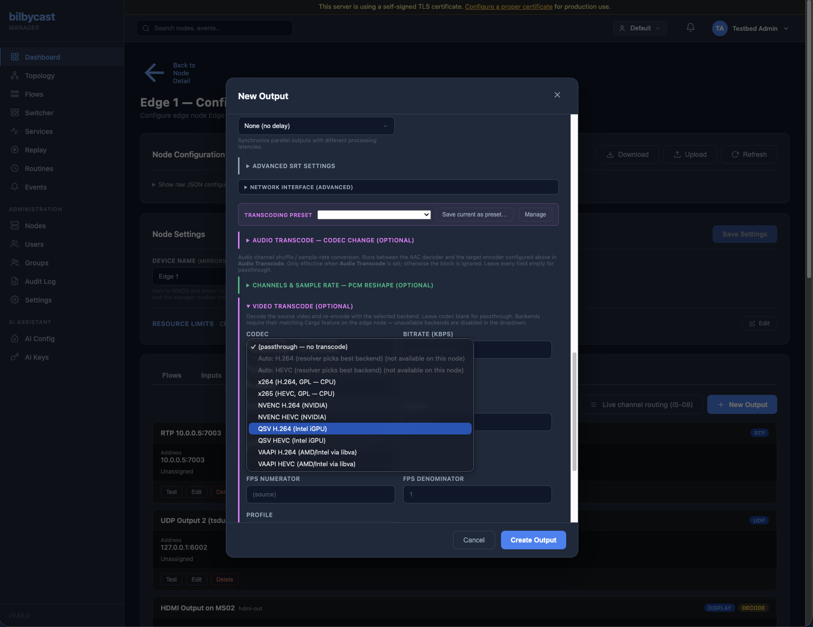

bilbycast-edge re-encodes media with two config blocks that sit on an input or an output:

- **`video_encode`** — decode the source video elementary stream and re-encode it as H.264 or HEVC, on a backend the host can actually open.
- **`audio_encode`** — decode the source audio elementary stream and re-encode it as AAC-LC, HE-AAC v1/v2, Opus, MP2 or AC-3, with an optional **`transcode`** companion block for channel routing and sample-rate conversion.

Both run **in-process**. There is no `ffmpeg` binary, no sidecar, no pipe: video goes through libavcodec via the `bilbycast-ffmpeg-video-rs` wrapper, and AAC goes through Fraunhofer FDK AAC via `bilbycast-fdk-aac-rs`. On the TS outputs the pair runs on a dedicated `SCHED_FIFO` priority-40 codec thread (one below wire-emit's 50, so wire pacing always wins) rather than on a Tokio worker — a 20 ms keyframe encode on a runtime worker would otherwise leak into PCR pacing on every other flow on the box.

Which backend an encoder actually opens is a property of the **host**, not of the config: see [Codec Matrix](/edge/codec-matrix/) for the per-vendor support grid and the verification commands.

## Where the blocks attach

What each **output** type accepts:

| Output | `audio_encode` | `transcode` | `video_encode` |
|---|:-:|:-:|:-:|
| `srt` | ✓ | ✓ | ✓ |
| `udp` | ✓ | ✓ | ✓ |
| `rtp` | ✓ | ✓ | ✓ |
| `rist` | ✓ | ✓ | ✓ |
| `rtmp` | ✓ (AAC family only) | ✓ | ✓ |
| `cmaf` / CMAF-LL | ✓ (AAC family only) | ✓ | ✓ — **explicit backend only**, no `*_auto` |
| `webrtc` | ✓ (`opus` only) | ✓ | ✓ — **H.264 only** |
| `hls` | ✓ | ✓ | ✗ — no such field |
| `st2110_30` / `st2110_31` / `rtp_audio` | ✗ | ✓ — standalone PCM reshape, no `audio_encode` | ✗ |
| `st2110_20` / `st2110_23` / `st2110_40` / `sdi` / `display` / `mxl_*` / `bonded` | ✗ | ✗ | ✗ |

`transcode` is only a stage inside the `audio_encode` pipeline on the compressed outputs, so setting it without `audio_encode` is **rejected at config load** rather than quietly ignored. (On the PCM outputs — ST 2110-30 and `rtp_audio` — it stands alone and reshapes linear PCM in place; see [Audio Gateway](/edge/audio-gateway/#the-transcode-block--per-output-pcm-conversion). An ST 2110-31 output shares that code path and applies the block to its AES3 payload unchecked — the *input* side refuses the same block outright, because SMPTE 337M sub-frames are not linear PCM and a PCM transcoder corrupts them.)

:::caution[HLS has no `video_encode` field at all]
`HlsOutputConfig` carries `audio_encode` and `transcode` but no `video_encode`, and the config structs do not reject unknown keys — so a `video_encode` block written onto an HLS output is **silently dropped** and the video is passed through untouched. For segmented egress with a re-encode, use a `cmaf` output: it writes fMP4 with an HLS `manifest.m3u8` and/or a DASH `manifest.mpd`.
:::

The same three blocks are accepted on **inputs**, which is usually the better place for them: one ingress re-encode is amortised across every output on the flow, and every member of a multi-input flow can be forced to the same codec so the broadcast-channel shape does not change on a switch.

| Input | `audio_encode` | `transcode` | `video_encode` |
|---|:-:|:-:|:-:|
| `rtp`, `udp`, `srt`, `rist`, `rtmp`, `rtsp`, `webrtc`, `whep` | ✓ | ✓ | ✓ |
| `test_pattern`, `media_player`, `replay` | ✓ | ✓ | ✓ |
| `st2110_20`, `st2110_23` | ✗ | ✗ | **required** |
| `mxl_video` | ✗ | ✗ | **required** |
| `sdi` | ✓ | ✗ | **required** |
| `st2110_30`, `rtp_audio` | ✓ (PCM → TS) | ✓ | ✗ |
| `mxl_audio` | ✗ — parsed, not wired | ✗ — parsed, not wired | ✗ |
| `st2110_31` | ✓ (`s302m` only) | ✗ | ✗ |
| `st2110_40`, `mxl_anc`, `bonded`, `mosaic` | ✗ | ✗ | ✗ |

The four inputs marked **required** carry uncompressed or baseband essence, so there is no bitstream to pass through: the encode *is* the ingress. A [multiviewer](/edge/multiviewer/) `mosaic` input exposes none of these knobs — its canvas encoder is configured on the mosaic itself.

`mxl_audio` is the odd one out: the schema carries `audio_encode` and `transcode`, and the config loader validates neither, but the MXL audio reader consumes its Float32 PCM grains without republishing them — so neither block changes anything today. An input with no `audio_encode` says so out loud, with a Warning `mxl_audio_no_encode_set`; one that sets it gets no such warning and still publishes nothing.

## Worked example — HEVC 4:2:2 10-bit contribution over SRT

A 1080p25 MPEG-2 feed arriving on UDP, re-encoded once at ingress to HEVC 4:2:2 10-bit for a contribution link, with the source 5.1 AC-3 downmixed to stereo AAC:

```json
{
  "inputs": [
    {
      "type": "udp",
      "id": "in-house-feed",
      "name": "House feed",
      "bind_addr": "0.0.0.0:5000",
      "video_encode": {
        "codec": "hevc_auto",
        "chroma": "yuv422p",
        "bit_depth": 10,
        "profile": "main422-10",
        "bitrate_kbps": 25000,
        "rate_control": "cbr",
        "gop_size": 50,
        "preset": "medium",
        "color_primaries": "bt709",
        "color_transfer": "bt709",
        "color_matrix": "bt709",
        "color_range": "tv"
      },
      "audio_encode": { "codec": "aac_lc", "bitrate_kbps": 192 },
      "transcode": { "channels": 2, "channel_map_preset": "5_1_to_stereo_bs775" }
    }
  ],
  "outputs": [
    {
      "type": "srt",
      "id": "srt-contrib",
      "name": "Contribution to MCR",
      "mode": "caller",
      "local_addr": "0.0.0.0:0",
      "remote_addr": "203.0.113.10:9000",
      "latency_ms": 500
    }
  ]
}
```

The output does no codec work at all — it forwards the already-normalised TS. Add a second output for a distribution ladder and it costs nothing more.

Per-**output** encoding is the same block on the output instead, and is the right shape when two destinations want different codecs from one source:

```json
{
  "type": "rtmp",
  "id": "yt-push",
  "name": "YouTube",
  "dest_url": "rtmps://a.rtmps.youtube.com/live2",
  "stream_key": "xxxx-xxxx-xxxx-xxxx",
  "video_encode": { "codec": "h264_auto", "bitrate_kbps": 6000, "width": 1920, "height": 1080 },
  "audio_encode": { "codec": "aac_lc", "bitrate_kbps": 128, "silent_fallback": true }
}
```

On the TS outputs (SRT / UDP / RTP / RIST) the audio stage runs first, then the video stage; PIDs neither stage owns — the other audio tracks, ST 2110-40 ancillary data, everything you did not pin — pass through untouched. The PMT is rewritten on every transcoded output: the video `stream_type` is set to the target codec, `PCR_PID` is forced to the rebuilt video PID (a source that pointed PCR at a separate PID would otherwise leave the PMT advertising PCR somewhere the edge does not emit it — a TR 101 290 P1.6 violation), and the section CRC32 is recomputed.

## `video_encode` field reference

| Field | Type | Default | Notes |
|---|---|---|---|
| `codec` | string | — | Required. `x264`, `x265`, `h264_nvenc`, `hevc_nvenc`, `h264_qsv`, `hevc_qsv`, `h264_vaapi`, `hevc_vaapi`, `h264_rkmpp`, `hevc_rkmpp`, or the resolver aliases `h264_auto` / `hevc_auto` / `auto` (bare `auto` means H.264). An explicit backend whose `video-encoder-*` Cargo feature this build lacks is refused at config load with the rebuild named; an `*_auto` alias is refused only when the build carries no video encoder at all. |
| `source_video_pid` | u16 | unset | Pin the source video elementary PID instead of taking the first video stream in the active program's PMT (`stream_type` `0x01`, `0x02`, `0x1B`, `0x24`). Range `0x0010`–`0x1FFE`. A pin that is absent from the live PMT falls back to first-match and logs `video_source_pid_not_found` — a **log line only**, no manager event, so a typo transcodes the wrong stream quietly. |
| `width` / `height` | u32 | source raster | 64–7680 / 64–4320, both **even**. Scaling is Lanczos via libswscale and is honoured on every re-encode path. |
| `fps_num` / `fps_den` | u32 | measured, else `30/1` | Set together or not at all; effective rate 0.5–240. **Never a resampler** — every source frame is encoded, so this *declares* the rate. On TS paths the rate is measured from PES DTS deltas and locked before the encoder opens, but **only when the field is unset**; pinning suppresses the measurement. RTMP, WebRTC and CMAF have no measurement and fall back to 30/1, so pin them. |
| `bitrate_kbps` | u32 | `8000` | 100–100000. |
| `gop_size` | u32 | `2 × fps` | 1–600. A CMAF output uses `60` when unset, whatever the frame rate, because its segmenter wants a steady GoP. |
| `preset` | string | `medium` | `ultrafast`, `superfast`, `veryfast`, `faster`, `fast`, `medium`, `slow`, `slower`, `veryslow`. |
| `profile` | string | encoder's choice | `baseline`, `main`, `high`, `high10`, `high422`, `high444` (H.264); `main10`, `main422-10`, `main422-10-intra` (HEVC). Validated against `chroma` + `bit_depth` — `main422-10` without `chroma: "yuv422p"` and `bit_depth: 10` is refused. |
| `chroma` | string | `yuv420p` | `yuv420p`, `yuv422p`, `yuv444p`. Combinations the named backend cannot carry are refused at config load, not at first frame. |
| `bit_depth` | u8 | `8` | `8` or `10`. |
| `rate_control` | string | `cbr` | `vbr`, `cbr`, `crf`, `abr`. **CBR is the default** — broadcast contribution wants a flat wire rate, and VBR complicates downstream mux ingest. |
| `crf` | u8 | `23` | 0–51, lower is better; broadcast typical 18–28. Only consulted with `rate_control: "crf"`, where it replaces `bitrate_kbps`. Mapped to `cq` on NVENC. |
| `max_bitrate_kbps` | u32 | unset | VBV ceiling for `vbr` / `abr`. 100–100000 and must be ≥ `bitrate_kbps`. Meaningless in `cbr` (the ceiling *is* `bitrate_kbps`) and in `crf`. |
| `bframes` | u8 | `0` | 0–16. **Pinned to 0 on RTMP** — FLV tags carry no composition-time offset, so a reordering encoder drives DTS backwards and most ingests drop the publisher. The pin logs `rtmp_bframes_unsupported`. |
| `refs` | u8 | encoder's choice | 1–16. |
| `level` | string | encoder's choice | e.g. `"4.0"`, `"5.1"`. Digits and dots, at most 8 characters. |
| `tune` | string | `zerolatency` on x264 / x265, **unset on every hardware backend** | The vocabularies are disjoint: x264 / x265 take `zerolatency`, `film`, `animation`, `grain`, `stillimage`, `fastdecode`, `psnr`, `ssim`; NVENC takes `hq`, `ll`, `ull`, `lossless`; QSV, VAAPI and RKMPP expose no `tune` at all. Validation is permissive over the union because an `*_auto` output does not know its backend until flow start; a tune the resolved backend cannot accept is **dropped** then, logging `encoder_tune_not_supported`. That drop matters — handing NVENC `zerolatency` fails `avcodec_open2` with `EINVAL`. |
| `color_primaries` | string | unset | `bt709`, `bt2020`, `smpte170m`, `smpte240m`, `bt470m`, `bt470bg`. |
| `color_transfer` | string | unset | `bt709`, `smpte170m`, `smpte2084` (alias `pq`), `arib-std-b67` (alias `hlg`), `bt2020-10`, `bt2020-12`. |
| `color_matrix` | string | unset | `bt709`, `bt2020nc`, `bt2020c`, `smpte170m`, `smpte240m`. |
| `color_range` | string | unset | `tv` (aliases `limited`, `mpeg`) or `pc` (aliases `full`, `jpeg`). |
| `hw_decode` | string | `auto` | Which backend decodes the **source** before re-encode: `auto`, `cpu`, `nvdec`, `qsv`, `vaapi`, `rkmpp`. See [Hardware decode of the source](#hardware-decode-of-the-source). |

:::caution[A re-encode does not inherit the source's colour signalling]
The four `color_*` fields are unset by default and nothing infers them from the input. Leave them unset on an HDR or BT.2020 feed and the output carries no colour signalling at all — which a downstream display reads as BT.709 SDR, with no way to recover. Set them explicitly on any contribution path that is not plain BT.709.
:::

## How `h264_auto` and `hevc_auto` resolve

`*_auto` is the right answer for most deployments. At flow start the edge asks the startup hardware probe what this host can actually open for the requested `(family, chroma, bit_depth)` and builds a **chain**, hardware first and CPU last:

| Family + chroma + bit depth | Chain (head first) |
|---|---|
| H.264, 4:2:0, 8-bit | `h264_rkmpp` ≻ `h264_nvenc` ≻ `h264_qsv` ≻ `h264_vaapi` ≻ `x264` |
| H.264, anything else | `x264` — no hardware H.264 encoder does 4:2:2, 10-bit or 4:4:4 |
| HEVC, 4:2:0, 8-bit | `hevc_rkmpp` ≻ `hevc_nvenc` ≻ `hevc_qsv` ≻ `hevc_vaapi` ≻ `x265` |
| HEVC, 4:2:0, 10-bit | `hevc_nvenc` ≻ `hevc_vaapi` ≻ `hevc_qsv` ≻ `x265` |
| HEVC, 4:2:2 (8 or 10-bit) | `hevc_vaapi` (Intel iHD) ≻ `x265` — NVENC and QSV are skipped rather than tried, because they reject 4:2:2 at `avcodec_open2` |
| HEVC, 4:4:4 | `x265` |

Candidates the host cannot do are filtered out before the chain is handed over, so the head is what the probe says will work. `h264_rkmpp` / `hevc_rkmpp` only ever compile into the `aarch64-linux-rockchip` artefact, where none of VAAPI / NVENC / QSV can resolve — that is why they lead.

**The chain is a fall-through, not a prediction.** A backend that probed cleanly at startup can still fail `avcodec_open2` later — the GPU is out of MFX sessions, a driver was updated under the running process, another flow took the last encode session. When that happens the pipeline logs the failure at `info` and opens the next candidate; landing anywhere but the head is logged at `warn` as a demote. Only when every candidate refuses does the encode fail.

Every backend in a chain is in the same codec family, which is what lets the PMT `stream_type` be settled from the head before any encoder opens.

An explicit backend name is a **one-element chain**: you asked for that encoder, so a silent substitution would be the wrong favour. If it cannot open, the flow reports it.

The chain is built on the TS re-encode path (SRT / UDP / RTP / RIST outputs and the ingress re-encode that feeds them), on RTMP, and on the multiviewer's canvas encoder. **Three paths do not take it** — they resolve one backend and open it with no fall-through:

- **WebRTC** resolves a single backend and additionally caps the result at H.264 — a resolver that came back with HEVC is refused with a Critical event, because browsers cannot decode it.
- **CMAF** resolves nothing at all: its re-encoder takes explicit backend names only, and `h264_auto` / `hevc_auto` / `auto` on a `cmaf` output are **refused at config load** with the reason named. Pick the backend by hand there.
- **Baseband ingest** — `st2110_20`, `st2110_23`, `mxl_video` and `sdi`, the four inputs where `video_encode` is required — shares one resolver call and opens its head only. It is also the one place an *explicit* backend is substituted: a named hardware encoder the host cannot carry at the requested chroma / bit depth is demoted to the same family's software encoder (`x264` or `x265`), logging `encoder_chroma_not_supported` rather than failing the input.



## Hardware decode of the source

A transcode is a decode *and* an encode, and `hw_decode` chooses the decode half independently of the encoder. `auto` (the default) walks **VAAPI ≻ NVDEC ≻ QSV ≻ RKMPP ≻ CPU** against the compiled-in `video-decoder-*` features and the probe; `cpu` forces software libavcodec, which is how you keep the host's hardware decode sessions free for other flows.

A forced backend the build or the host cannot satisfy **does not fail the flow**: the edge logs `hw_decode preference … unavailable …; falling back to CPU` and runs on CPU, and so does an edge whose startup probe never ran. That is deliberately unlike the [display output](/edge/display/), which raises an event for the same situation — so on a transcode, check the log rather than the Events page when you expect hardware decode and the CPU is busier than you budgeted for.

These are the same decoders the local-display path uses, so an edge built for HDMI playout gets hardware transcode decode for free.

## `audio_encode` and its encoders

Everything encodes in-process on a default build (`fdk-aac` and `media-codecs` are both on, and all three release artefacts carry them):

| Codec | Encoder | Max channels | Default bitrate | Notes |
|---|---|:-:|:-:|---|
| `aac_lc` | Fraunhofer FDK AAC | 8 | 128 kbps | The general-purpose choice; 5.1 and 7.1 both encode. |
| `he_aac_v1` | Fraunhofer FDK AAC | 2 | 64 kbps | SBR. |
| `he_aac_v2` | Fraunhofer FDK AAC | 2 (exactly) | 32 kbps | Parametric Stereo — mono is refused at config load, not at flow start. |
| `opus` | libopus via libavcodec | 2 | 96 kbps | WebRTC outputs only. Always 48 kHz on the wire whatever `sample_rate` says. |
| `mp2` | libavcodec | 2 | 192 kbps | DVB / SD broadcast. |
| `ac3` | libavcodec | 6 | 192 kbps | ATSC; 5.1 encodes. |
| `s302m` | none — a lossless PCM wrap | 2, 4, 6 or 8 | n/a | PCM and AES3 inputs only. `bitrate_kbps` is **refused** rather than ignored, and `sample_rate` must be exactly 48000. |

Only a build compiled *without* `fdk-aac` / `media-codecs` falls back to an `ffmpeg` subprocess for the affected codecs — on a release binary the encoder never leaves the process, so there is no restart budget, no pipe, and no `ffmpeg` to install.

`bitrate_kbps` is 16–512. `sample_rate`, when set, must be one of **8000, 16000, 22050, 24000, 32000, 44100, 48000**; unset follows the source. `channels` unset follows the source, and the ceiling above is enforced per codec at config load.

**Opus is accepted on a `webrtc` output and nowhere else.** MPEG-TS has no standard Opus mapping, so SRT, UDP, RTP, RIST and HLS refuse it; FLV carries the AAC family only, so RTMP refuses it; and the CMAF audio sample entry is MPEG-4 AAC, so CMAF refuses it too. All of that is a config-load error, not a surprise at flow start.

The full `audio_encode` and `transcode` reference — `source_audio_pid` pinning, `silent_fallback`, the four `opus_*` knobs, channel-map presets, SRC quality and dither — lives on [Audio Gateway](/edge/audio-gateway/#the-audio_encode-block--compressed-audio-egress-rtmp--hls--webrtc).

## Combinations that are refused

Validation rejects these at config load and on every `update_config`, so nothing reaches a running flow:

| Combination | Why |
|---|---|
| `audio_encode` or `video_encode` + `transport_mode: "audio_302m"` | The 302M path owns the TS stream already. |
| `audio_encode` or `video_encode` + SMPTE 2022-7 `redundancy` (SRT / RTP / RIST) | The two legs would carry independently encoded bitstreams; a receiver cannot merge them. |
| `audio_encode` or `video_encode` + SMPTE 2022-1 `fec_encode` (RTP) | Re-muxing breaks the RTP sequence-number space the FEC matrix is computed over. |
| `audio_encode` or `video_encode` + SRT `packet_filter` FEC | Same reason. |
| `transcode` without `audio_encode` on a compressed output | `transcode` is a stage *inside* the encode pipeline; alone it would be a silent no-op. |
| `audio_encode` + `video_only: true` (WebRTC) | An audio MID has to be negotiated in the SDP. |
| Multi-program `pid_overrides` + either block | The in-place transcoders handle one program at a time. Split into one output per program, each with its own `program_number` filter. |
| An HEVC codec on a `webrtc` output, including `hevc_auto` | Browsers do not decode HEVC, so a rebuild would not help either. |
| `h264_auto` / `hevc_auto` / `auto` on a `cmaf` output | The CMAF re-encoder resolves no alias. |

A transcoded output is also outside the scope of [cross-node egress alignment](/edge/clocking/): `epoch_lock` requires non-transcoded forwarding, so alignment and PCR/PTS regeneration are mutually exclusive.

## Confirming what actually ran

The resolved backend reaches the stats API once the encoder has opened — it is the backend that *opened*, not the one that was requested, so a fall-through demote is visible:

```bash
curl -s http://localhost:8080/api/v1/stats/<flow_id> \
     -H "Authorization: Bearer $TOKEN" | \
  jq '.outputs[] | {output_id, video_encode_stats}'
```

`video_encode_stats.encoder_backend` reads `x264`, `x265`, `nvenc`, `qsv`, `vaapi` or `rkmpp`; alongside it, `input_codec` / `output_codec`, the target raster and rate, `dropped_frames`, `last_latency_us`, and `source_pid` / `source_stream_type` (which video stream the replacer locked onto). The same block appears under `.input` for an ingress re-encode. Outputs that pass video through carry no `video_encode_stats` at all.

In the log, an Auto resolution prints the whole chain at flow start:

```
video_encode auto-resolved 'hevc_auto' → chain ["hevc_vaapi", "x265"] (head fires first; later entries are fall-through)
```

Encode cost is charged against the node's resource budget — hardware backends start at 100 units and software at 500, scaled by pixel rate, chroma and bit depth. See [Resources & Capacity](/edge/resources/) for the formula and the per-family hardware session caps.

## Known limitations

- **Frame rate is declared, never converted.** No path resamples; a pinned rate that disagrees with the source mistunes rate control, the default GOP and the SPS VUI, and logs `video_encode_fps_mismatch` once per encoder run. Output PES PTS still carry the source clock, so this is not a proportional lipsync drift.
- **HLS has no `video_encode`.** Use `cmaf` for segmented egress with a re-encode.
- **No keyframe alignment to the source.** The encoder emits IDRs on its own GOP cadence — except on a multi-input flow, where switching to an input that has ingress `video_encode` forces an IDR on the first frame after the take, so switch latency at the receiver stays at one to two frames instead of up to a GOP.
- **B-frames are off by default everywhere and unavailable on RTMP.**
- **Scaling covers 4:2:0 and 4:2:2 at 8 and 10-bit.** A 4:4:4 target has no scaler destination format, so a resize request logs a warning and the encoder crops instead of scaling.
- **ST 2110-22 (JPEG XS)** transcoding is deferred pending a JPEG XS wrapper crate.

## See also

- [Codec Matrix](/edge/codec-matrix/) — per-backend chroma / bit-depth support, what `*_auto` activates on each host class, and the verification commands.
- [Audio Gateway](/edge/audio-gateway/) — the full `audio_encode` / `transcode` reference, including PCM and SMPTE 302M paths.
- [Configuration](/edge/configuration/) — where these blocks sit in `config.json`, field by field, per input and output type.
- [Resources & Capacity](/edge/resources/) — encode cost units and hardware session limits.
- [Master Clock & A/V Sync](/edge/clocking/) — how a re-encode interacts with PCR regeneration and egress alignment.
