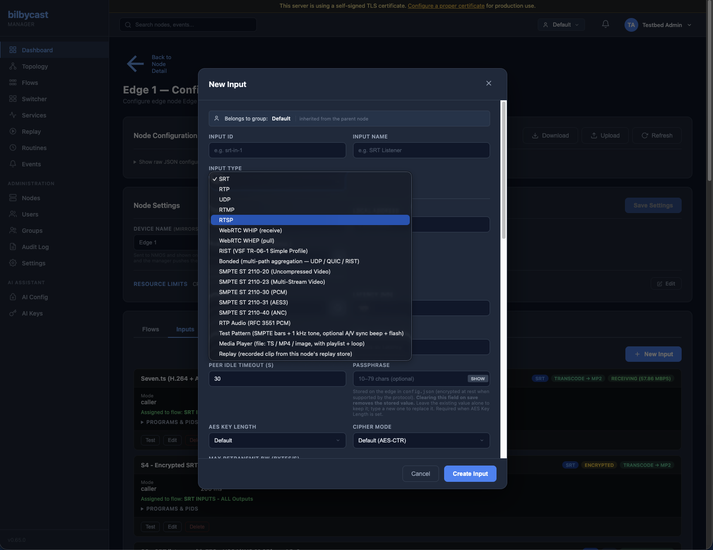
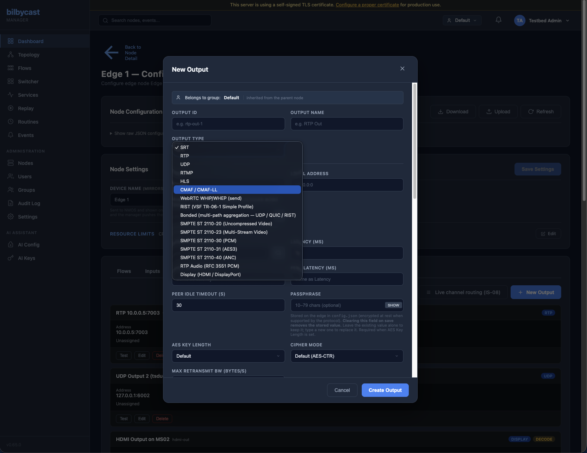
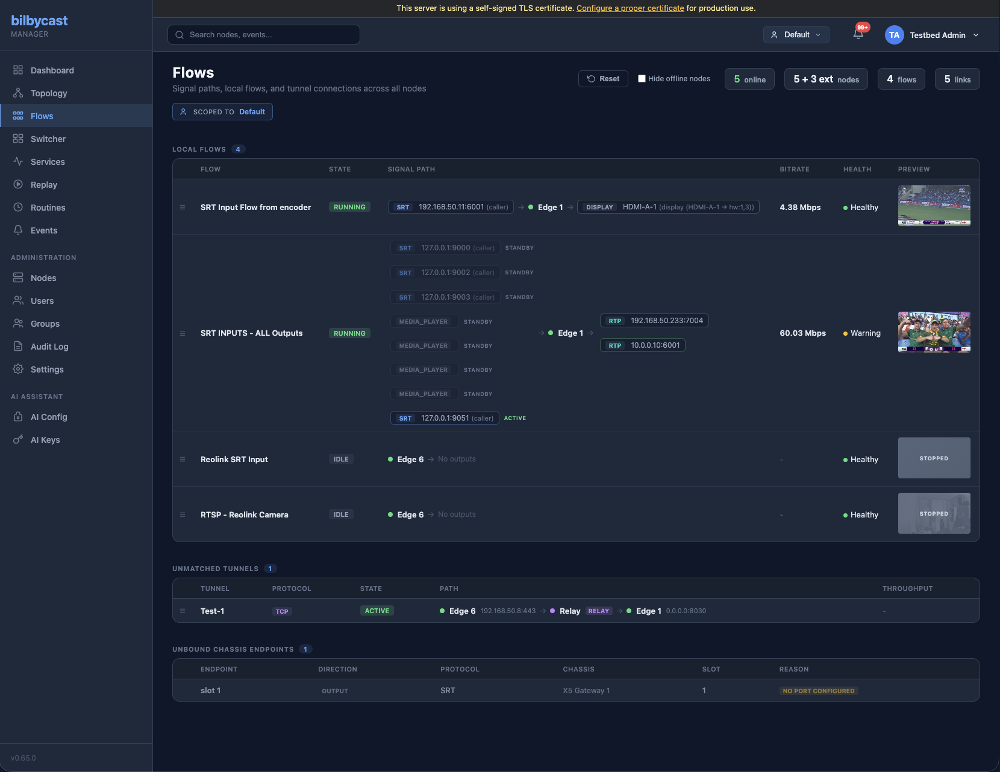

This walkthrough creates a simple SRT-to-RTP flow using the manager web UI. It assumes you've already finished the [manager](/manager/getting-started/) and [edge](/edge/getting-started/) installs and the edge shows **online** at `/admin/nodes/`.

## What is a flow?

A **flow** is one or more inputs feeding one or more outputs. The input receives media; each output independently delivers it to a destination. Slow outputs drop packets rather than back-pressuring — they never affect the input or any other output.

```
Input (SRT) ──► broadcast channel ──► Output 1 (RTP)
                                  ──► Output 2 (UDP)
                                  ──► Output 3 (RTMP)
```

## Step 1 — Open the node config page

In the manager, go to **Admin → Nodes** and click the edge you just registered. Then click **Configure**. The config page opens on the **Flows** tab, alongside **Inputs**, **Outputs**, **IP Tunnels** and **Uplink Monitoring** — plus a **Tuning** tab on nodes that advertise the `node_tuning` capability.

<!-- TODO screenshot: node config page with the tab strip visible -->

## Step 2 — Add an SRT input

1. **Inputs** tab → **New Input**.
2. Pick **SRT** as the type.
3. Set:
   - **Input ID**: `in-srt` — required; the name auto-fills from it if you leave it blank
   - **Input Name**: `Source feed`
   - **Mode**: `Listener`
   - **Local Address**: `0.0.0.0:9000`
   - **Latency (ms)**: `120`
4. **Create Input**. The new input appears in the list with a status pill — yellow until the first sender connects.



## Step 3 — Add an RTP output

1. **Outputs** tab → **New Output**.
2. Pick **RTP** as the type.
3. Set:
   - **Output ID**: `out-rtp`
   - **Output Name**: `Local preview`
   - **Destination Address**: `127.0.0.1:5004`
4. **Create Output**.



## Step 4 — Wire them into a flow

1. **Flows** tab → **New Flow**.
2. Set:
   - **Flow ID**: `my-first-flow`
   - **Flow Name**: `My first flow`
   - **Flow Type**: leave on `Standard — has outputs`
   - **Inputs**: select `Source feed`
   - **Outputs**: select `Local preview`
   - **Enabled**: `Yes - Start on apply`
3. **Apply to Node**. The flow appears with a green dot once both ends settle.



## Step 5 — Send some media

From any machine that can reach the edge, push an SRT stream at port 9000:

```bash
# srt-live-transmit (Haivision)
srt-live-transmit udp://your-source:1234 srt://EDGE-IP:9000

# Or ffmpeg (build with --enable-libsrt)
ffmpeg -re -i input.mp4 -c copy -f mpegts srt://EDGE-IP:9000
```

The flow card in the manager updates within a couple of seconds — bitrate, packet rate, and a live thumbnail.

## Step 6 — Watch the output

```bash
ffplay -i rtp://127.0.0.1:5004
```

Or in VLC: **Media → Open Network Stream → `rtp://@:5004`**.

## Adding more outputs

Open the flow, click **Edit**, add another output under **Outputs**, and **Save Changes** (on an existing entity all three modals relabel their submit button to that). Each output subscribes independently — you can add an RTP multicast, an SRT push to a remote site, and an RTMP push to YouTube on the same flow without affecting the others.

## What to read next

- [Supported protocols](/edge/supported-protocols/) — full protocol reference and which fields each one takes.
- [Configuration](/edge/configuration/) — every input, output, and flow field documented.
- [Replay](/manager/replay/) — record live flows and push clips back to air.
- [Switcher](/manager/switcher/) — PGM/PVW director console for live production.

<details>
<summary>Advanced — the same flow as a JSON config</summary>

If you'd rather hand-edit the on-disk config instead of using the UI, the equivalent v2 config is:

```json
{
  "version": 2,
  "server": { "listen_addr": "0.0.0.0", "listen_port": 8080 },
  "inputs": [
    {
      "id": "in-srt",
      "name": "Source feed",
      "type": "srt",
      "mode": "listener",
      "local_addr": "0.0.0.0:9000",
      "latency_ms": 120
    }
  ],
  "outputs": [
    {
      "id": "out-rtp",
      "name": "Local preview",
      "type": "rtp",
      "dest_addr": "127.0.0.1:5004"
    }
  ],
  "flows": [
    {
      "id": "my-first-flow",
      "name": "My first flow",
      "enabled": true,
      "input_ids": ["in-srt"],
      "output_ids": ["out-rtp"]
    }
  ]
}
```

Inputs, outputs, and flows are independent top-level entities; flows reference inputs and outputs by ID. The full schema is in [Configuration](/edge/configuration/).

</details>
