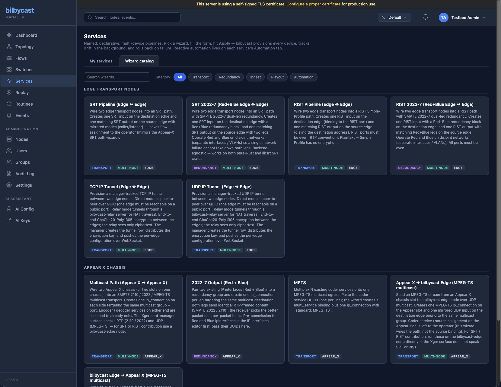

bilbycast-manager has a **driver-aware** architecture: every device type (edge, relay, Appear X, ...) registers a `Driver` implementation that contributes to the WebSocket protocol, REST surface, topology rendering, and AI assistant workflow. Adding support for a new third-party device is a matter of writing a driver and (usually) a sidecar API gateway — no manager core changes required.



This page is for developers integrating new device types. Operators using existing drivers don't need to read it.

## What a driver provides

A driver is a Rust implementation of the `DeviceDriver` trait (defined in `bilbycast-manager/crates/manager-core/src/drivers/mod.rs`), living in its own per-device plugin crate `bilbycast-manager/crates/device-<name>/`. It supplies:

| Function | Purpose |
|---|---|
| Device type identifier | The string used in `node.device_type` (e.g., `"edge"`, `"appear_x"`) |
| Validation | `validate_command()` checks an incoming `command` payload before the manager core sends it, and returns descriptive errors |
| Command catalogue | `supported_commands()` — every command the device accepts, each with the minimum role needed to issue it |
| Action descriptors | Structured definitions of every action the driver exposes to the AI assistant and generic UI |
| Topology rendering hints | An accent colour and a flag for whether the type is drawn in topology at all; the list of "ports" (inputs / outputs) comes from the driver's browser-side JS plugin, not from Rust |
| Health derivation | Maps the driver's native event/alarm format into a status string (`ok`, `degraded`, `critical`, `unknown`) |
| AI context contribution | A short text block describing the driver's protocol semantics, included in AI-assistant prompts |

The trait is designed so that **everything that varies per device type lives in the driver**, and everything that's shared (auth, push status, ghost cleanup, audit, RBAC) lives in the manager core.

## How drivers integrate with the rest of the system

```text
                    ┌──────────────────────────┐
                    │     Manager core         │
                    │   (auth, RBAC, audit,    │
                    │    push status, sync)    │
                    └────────────┬─────────────┘
                                 │
        ┌────────────────────────┼────────────────────────┐
        ▼                        ▼                        ▼
  ┌───────────┐           ┌───────────┐            ┌──────────────┐
  │ EdgeDriver │           │ RelayDriver│            │ AppearXDriver│
  └─────┬─────┘           └─────┬─────┘            └──────┬───────┘
        │                       │                         │
        │ WebSocket             │ WebSocket               │ WebSocket
        ▼                       ▼                         ▼
   bilbycast-edge          bilbycast-relay      bilbycast-appear-x-api-gateway
                                                        │
                                                        │ JSON-RPC over HTTPS
                                                        ▼
                                                  Appear X chassis
```

The pattern is the same for every driver: the manager core talks to a Rust process (the device or its sidecar gateway) over the standard bilbycast WebSocket protocol. The sidecar takes responsibility for translating between the bilbycast protocol and the device's native API.

## Two-part pattern: driver + sidecar gateway

For a third-party device that doesn't natively speak the bilbycast WebSocket protocol, the recommended pattern is **driver + sidecar**:

1. **Manager-side driver** — A Rust plugin crate `bilbycast-manager/crates/device-<vendor>/` that implements the `DeviceDriver` trait and exposes vendor-specific actions to the manager.
2. **Sidecar API gateway** — A standalone Rust binary that maintains a persistent WebSocket connection to the manager (using the same auth as a real edge or relay) and translates manager commands into the device's native API calls. It also polls the device for stats / health / alarms and forwards them as bilbycast `stats` / `health` / `event` messages.

The sidecar runs anywhere it can reach the device and the manager — usually colocated with the device. From the manager's perspective, it looks identical to a native bilbycast node.

[`bilbycast-appear-x-api-gateway`](/appear-x-gateway/overview/) is the reference implementation of this pattern. Its source layout is intended to be copy-able as a template — see [Adding New Device Gateways](/appear-x-gateway/adding-new-device-gateways/).

## Action descriptors

Action descriptors are how a driver advertises its operations to the manager. Each descriptor includes:

```rust
pub struct AiActionDescriptor {
    pub name: String,                   // e.g., "set_ip_input"
    pub display_label: String,          // human-readable label
    pub category: ActionCategory,       // ConfigAction | SimpleAction
    pub ai_prompt_description: String,  // sent to the AI assistant
    pub ai_prompt_example: String,      // example JSON the AI should produce
    pub ui_hints: ActionUiHints,
}

pub struct ActionUiHints {
    pub button_label: String,
    pub button_style: String,           // "apply", "delete", "stop", "start", "restart", "info"
    pub payload_key: Option<String>,    // ConfigAction only
    pub preview_type: Option<String>,   // "flow", "tunnel", "generic" — ConfigAction only
    pub execution_mode: String,
}
```

- **`name`** — a bare identifier (`set_ip_input`, `create_flow`), not driver-prefixed. It is wizard ids, not action names, that carry a `<driver>.` prefix (`edge.srt-pipeline`).
- **`category`** — `ConfigAction` (carries a config payload, so the UI draws a preview card plus an Apply button) or `SimpleAction` (a single Execute button).
- **`ai_prompt_description`** — the instruction that tells the AI assistant when and how to use this action. Be specific about what the action does and what its preconditions are.
- **`ai_prompt_example`** — the example JSON envelope the assistant should imitate for this action.
- **`ui_hints.payload_key`** / **`ui_hints.preview_type`** — which key of the AI response holds the config, and which preview renderer draws the confirm card. Only meaningful for a `ConfigAction`.
- **`ui_hints.execution_mode`** — a plain string, not an enum: one of `command`, `flows_create`, `flows_delete`, `tunnels_create`, `tunnels_delete`. It names the endpoint the action is expected to end up calling, but nothing reads it today — neither the server nor the browser UI dispatches on it. See [AI Assistant](/manager/ai-assistant/#execution-modes).

RBAC is not part of the action descriptor. The minimum role lives on the driver's `supported_commands()` catalogue (`CommandDescriptor.requires_role`), and the manager core resolves it per request before sending anything.

When a new driver is registered, its descriptors are served by the driver-discovery API:

- They appear in `GET /api/v1/device-types` (and `GET /api/v1/device-types/{device_type}`) as the device type's `ai_actions`, alongside `supported_commands` and the driver's UI capabilities.
- An AI-proposed plan is applied through `POST /api/v1/ai/apply`, which dispatches on the action *name* — not on `execution_mode`.
- Everything else lands on `POST /api/v1/nodes/{id}/command`: the manager core resolves the driver, calls `validate_command()`, checks the caller's role against the command catalogue, and only then sends over the node's WebSocket.

## Health derivation

`extract_health_status()` returns a free-form `Option<String>` — the trait imposes no enum, and nothing downstream normalises the result. It is a declarative surface today: the node hub caches each node's health payload verbatim and serves that to the UI, so nothing in the manager actually calls the method yet outside the driver-contract test. The four strings the drivers agree on are:

| Status | When |
|---|---|
| `ok` | All flows / tunnels / inputs are running and no active alarms |
| `degraded` | Degraded service: minor alarms, partial outages, congestion |
| `critical` | Service-impacting failure: major alarms, no input lock, dead device |
| `unknown` | The health payload carried nothing the driver could read |

The edge and relay drivers do nothing but pass through the `status` string the node reported — and both binaries hardcode `"status": "ok"` on every health beat, so in practice only an Appear X node ever reports one of the other three. The Appear X driver takes the same shortcut when the sidecar sent one — which today it always does — and otherwise derives a status from the alarm severity field of the Appear X JSON-RPC API:

| Appear X health payload | Derived status |
|---|---|
| A `status` string is present | returned verbatim — the alarm mapping below is skipped entirely |
| `alarms` contains a `MAJOR` or `CRITICAL` entry | `critical` |
| `alarms` contains a `MINOR` or `WARNING` entry | `degraded` |
| `alarms` is present but carries no recognised severity | `degraded` |
| `alarms` is present and empty | `ok` |
| No `alarms` key at all | `unknown` |

The mapping is internal to the driver — the manager core doesn't need to know about Appear X severity classes.

## Topology rendering

Drivers contribute to the topology view from both halves of the plugin:

- **Rust** — `ui_capabilities()` declares `list_in_topology` (whether nodes of this type should be drawn as first-class topology nodes) and an `accent_color` name: `"blue"` for edge, `"purple"` for relay, `"amber"` for Appear X. Both are served on `GET /api/v1/device-types`, but no renderer reads them yet — the topology canvas still picks its own colours from the node's device type.
- **JavaScript** — the per-driver browser plugin's optional `extractEndpoints(node)` returns the "ports": the abstract inputs and outputs the device exposes, used to draw flow links between devices. `topology/render.js` calls it per node and either replaces the built-in endpoint list (for a pure plugin device like Appear X) or appends to it.

There is no driver icon hook — node glyphs are drawn by the topology renderer itself. The graph view (force-directed) and flow view (deterministic columns) both consume the endpoint list, so a third-party device appears in topology once its JS plugin is in place.

## Walking through `AppearXDriver`

To make this concrete, here's how `AppearXDriver` (in `crates/device-appear-x/src/lib.rs`) implements each piece:

| Piece | What `AppearXDriver` does |
|---|---|
| `device_type()` | Returns `"appear_x"` |
| `validate_command(action)` | Validates Appear X-specific payloads (IP input/output addressing, slot/board IDs in hex). The manager core then sends the validated command to the connected sidecar over the existing WebSocket; the sidecar handles JSON-RPC translation |
| `supported_commands()` | The command catalogue, each entry carrying the role needed to issue it |
| `ai_actions()` | Returns the Appear X action descriptors (`set_ip_input`, `set_ip_output`, `get_inputs`, `get_outputs`, `get_services`, `get_alarms`, `get_chassis`, and many more) |
| `extract_metrics(stats)` | Rolls the latest stats up into the dashboard summary — alarm counts by severity, input/output counts, aggregate bitrates and RTP / CC error totals |
| `extract_health_status(health)` | Maps alarm severity to `ok` / `degraded` / `critical` / `unknown`, as tabulated above |
| `ui_capabilities()` | Declares the topology / dashboard participation flags, the `"amber"` accent colour, and that this device type is fronted by a gateway sidecar polling an external target |
| `ai_context()` | Returns a short Appear X protocol primer the AI assistant can use to generate sensible commands |

The full source is in `bilbycast-manager/crates/device-appear-x/src/lib.rs`.

## Adding a new driver

The high-level steps are:

1. Create a new plugin crate `crates/device-<vendor>/` and implement the `DeviceDriver` trait.
2. Register the driver on the `DriverRegistry` that `crates/manager-server/src/main.rs` builds at startup — the registry type itself lives in `manager-core/src/drivers/mod.rs`, but the registrations are in `main.rs`.
3. Add the browser-side plugin module at `crates/manager-server/src/ui/static/js/devices/<vendor>/index.js` (copy `_example/`), add its one-line `import` to `devices/index.js`, and add the matching `include_str!` constant plus `.route()` in `crates/manager-server/src/ui/mod.rs`. The JS is compiled into the binary rather than served from a directory, so a module without those two wiring edits is never fetched. The plugin declares its accent colour and capability gates inline — the shipped ones mirror their driver's `ui_capabilities()` by hand rather than fetching `GET /api/v1/device-types/{device_type}` — and the sibling `ui-manifest` endpoint is still a Phase-2 stub returning empty arrays.
4. (Optional but recommended) Build a sidecar gateway as a standalone Rust binary — copy the layout of `bilbycast-appear-x-api-gateway/`.
5. Add a docs page describing the device type, the sidecar setup, and any vendor-specific configuration.
6. Add unit tests for the validation and action-descriptor surfaces.

For a step-by-step walkthrough using Appear X as the worked example, see [Adding New Device Gateways](/appear-x-gateway/adding-new-device-gateways/).
