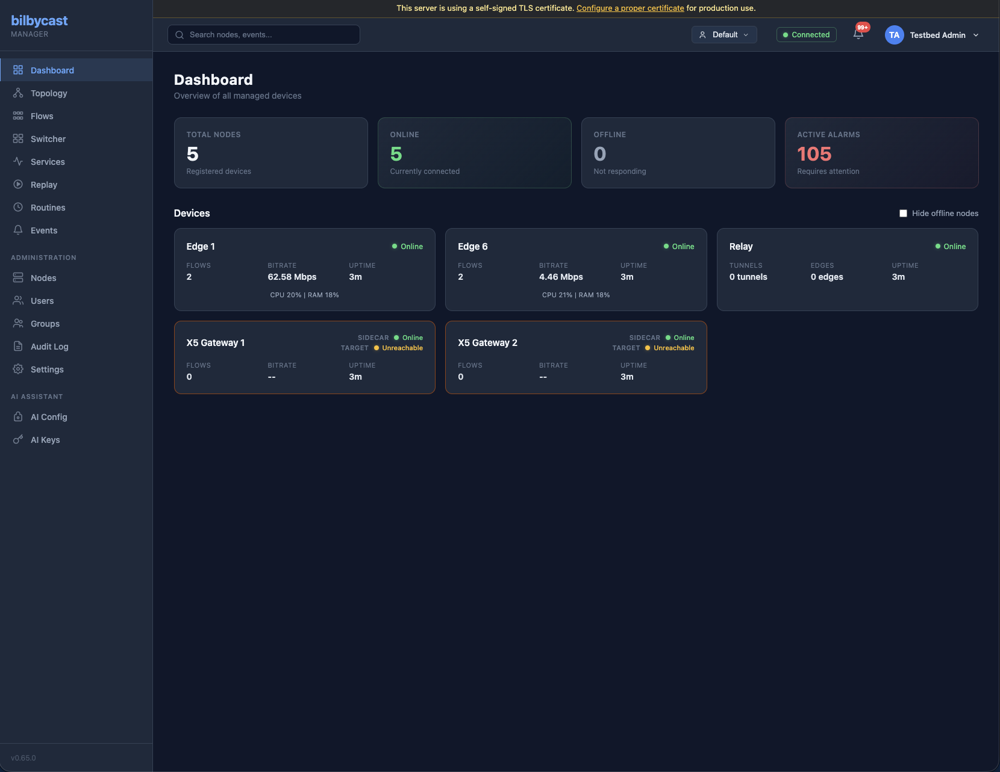

bilbycast-manager is the centralized control plane for bilbycast. It provides a web dashboard, REST API, and WebSocket connectivity for real-time status, configuration, and control of distributed media transport nodes.



## Key Features

- **Web dashboard** — Real-time overview of all managed devices with status, flows, and bitrate.
- **Network topology** — Live visual map with graph and signal flow views.
- **Node management** — Register, configure, and monitor edge nodes and relay servers remotely.
- **[Live Switcher](/manager/switcher/)** — In-browser PGM/PVW director console with Take semantics, presets, and per-tenant pages.
- **[Node Bus Matrix](/manager/node-bus/)** — Three-pane crosspoint authoring (Sources / Matrix / Inspector) for the node-wide ES bus. Click-to-wire and drag-and-drop equally first-class. Pending-state diffing with Apply / Discard. Salvo export captures a routing snapshot as a Switcher preset.
- **[Visual Flow Editor](/manager/visual-flow-editor/)** — Build a node's configuration by drawing it on a canvas, with a draft → validate → preview → deploy cycle and a snapshot taken before every change. **Master graphs** put several units on one canvas and wire cross-unit transport between them.
- **[Aligned Output](/manager/aligned-output/)** — Put two nodes forwarding the same feed on one shared timeline, so a downstream switcher can cut between them without a timing jump.
- **[Routines](/manager/routines/)** — Cron-scheduled named target state across flows, DST-correct via IANA timezones, with manual activation, skip-next-fire, and partial/failed/missed events.
- **[Multiviewer Walls](/manager/multiviewer/)** — Author a wall in the browser — layout stage, tile routing, salvo save and recall — then deploy it to a unit that composites it and publishes it as an ordinary flow. Needs an edge advertising `mv-compositor`.
- **Multiview** — A grid of flow thumbnails the manager assembles by itself (2×2, 3×3, 4×4, or auto-fit up to 64 tiles), polled from the per-flow thumbnail endpoint. Still frames, and no edge capability gates the page — but a flow with thumbnails switched off reads **Thumbnails off** rather than a picture. A different surface from Multiviewer Walls above.
- **[Replay](/manager/replay/)** — Per-flow JKL scrub timeline, clip library, sport-tagging profiles, and one-click push-to-air on top of the edge replay server.
- **[Address Pools](/manager/address-pools/)** — Declared ranges of ports and multicast groups the manager allocates cross-unit connections from, with a record of who holds what.
- **Services** — Named, declarative, multi-device pipelines: pick a wizard, fill the form, Apply. The plan is executed step by step and rolled back in reverse on the first failure, and a background reconciler raises `service_drift` when a device stops matching. Endpoints in the [API Reference](/manager/api-reference/).
- **DVR Sessions** — One browser-viewable, seekable feed per session: a source flow on an edge (a playback rendition plus a low-resolution all-intra proxy for jog and shuttle) bound to a relay that holds both for the length of the retention window. Every feed is gated — a revocable link for a one-off guest, a portal login for staff. The relay half is [Viewer Distribution](/relay/viewer-distribution/).
- **Events & alarms** — Every event raised by every managed node in one filterable log: severity, category, node, free-text search, date range, and a display timezone.
- **[Multi-tenant Groups](/manager/multi-tenant-groups/)** — Per-tenant users, nodes, tunnels, switcher pages, routines, audit trail, quotas, and per-tenant logo + brand-colour theming. Access-control boundary only.
- **[On-edge Media Library](/manager/media-library/)** — Browser upload + delete of slates, loops, and emergency-fallback content for the edge `media_player` input, with quota enforcement.
- **AI assistant** — AI-assisted flow configuration with support for multiple LLM providers (OpenAI, Anthropic, Gemini).
- **Device driver pattern** — Extensible architecture supporting edge nodes, relays, and third-party devices via vendor sidecars.
- **Hybrid RBAC** — Platform role (`user` / `super_admin`) plus per-group `viewer` / `operator` / `admin` membership, with shared resources via `resource_shares`.
- **MFA + SSO** — TOTP second factor for local accounts; OIDC Single Sign-On (Authorization Code + PKCE) with optional group-sync — see [Security](/manager/security/).
- **Encryption at rest** — Envelope encryption (AES-256-GCM with per-domain HKDF-SHA256 KEKs) for every secret; one-shot master-key rotation via `rotate-master-key`.
- **[Encrypted backup & restore](/manager/backup/)** — Two passphrase-sealed paths: portable application-level export/import, and DR-grade `pg_dump` archive coordinated via Postgres advisory lock.
- **[Active/Active HA](/manager/active-active-ha/)** — Two manager instances against a shared Postgres cluster, with cross-instance pubsub via LISTEN/NOTIFY and per-region observability on Prometheus metrics.

## Architecture

The manager is a full-stack Rust application:

- **Backend** — Axum REST/WebSocket server backed by **Postgres 18**.
- **Frontend** — Embedded static HTML + vanilla JavaScript with hand-written CSS (`shared.css`), served same-origin under an enforcing Content-Security-Policy (`script-src 'self'`). The Visual Flow Editor and Master Graphs pages additionally load a bundled React + xyflow canvas; there is no CSS framework.
- **Communication** — All nodes connect outbound to the manager via WebSocket, enabling management of devices behind firewalls and NAT.

### Device Driver Pattern

The manager uses a driver-aware architecture where each device type has a registered driver:

| Driver | Device Type | Description |
|--------|------------|-------------|
| **EdgeDriver** | `edge` | bilbycast-edge transport nodes |
| **RelayDriver** | `relay` | bilbycast-relay servers |
| **AppearXDriver** | `appear_x` | Appear X encoder/gateway units (via API gateway sidecar) |

New device types are added by implementing the `DeviceDriver` trait — the hub, database, API routes, and AI assistant work automatically for any registered driver.

## Deployment

```bash
# Build
cargo build --release

# Initialize database and create first admin
./target/release/bilbycast-manager setup --config config/default.toml

# Start the server
./target/release/bilbycast-manager serve --config config/default.toml
```

Required environment variables:
- `BILBYCAST_JWT_SECRET` — 64-char hex string for JWT signing
- `BILBYCAST_MASTER_KEY` — 64-char hex string for AES-256-GCM encryption

See the [Deployment Guide](/getting-started/deployment/) for full setup instructions and TLS configuration.
