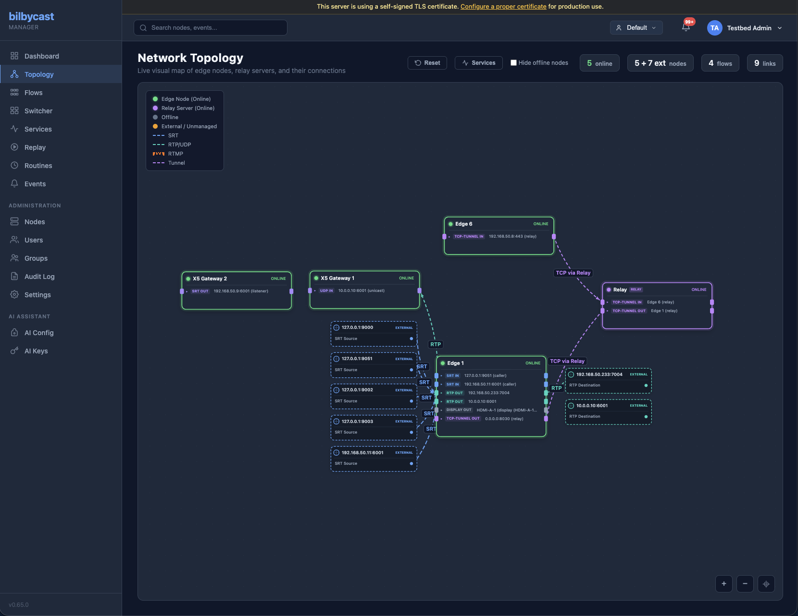

The bilbycast-manager **Topology** page is a live visualization of every node, flow, tunnel, and signal path the manager knows about. It exists to answer one operational question at a glance: *which nodes are talking to which, and over what?*



There is a single view — one force-directed canvas of edges, relays, and third-party gateways. Its entire chrome is a **Reset** button, a **Services** toggle, a **Filters** panel that doubles as the legend, and a zoom toolbar (`+` / `−` / fit). What is remembered per-user is node *positions*, not a view selection.

The canvas reads from the manager's WebSocket stats stream (`/ws/dashboard`), so it updates without polling.

If what you want is a deterministic left-to-right signal-flow picture, open a service's **Overview** tab on the manager's `/services` page — that diagram is derived from the service's own provisioning steps rather than from an arbitrary flow.

## What appears on the canvas

| Element | Source |
|---|---|
| Edge / relay / Appear X **node** | Any registered device with a recent `health` heartbeat |
| **Tunnel link** between two edges | Active tunnel from `GET /api/v1/tunnels` (or its driver-specific equivalent) |
| **Flow link** from input to output | Per-flow stats stream — synthesised when input and output land on different nodes |
| **Node colour** | Device type (driver-defined) |
| **Node size** | Card width is fixed at 280 px; height grows with the number of input + output endpoint rows drawn on it (endpoints are grouped into one mini-card per flow; each row carries a protocol badge and the address), not with flow count |
| **Link colour** | Protocol: SRT blue, RTMP orange, UDP violet, RTP teal, RTSP yellow, HLS green, CMAF cyan, WebRTC pink, tunnel purple, bond purple (anything unrecognised, RIST included, falls back to grey). Dimmed to grey when the link is offline (`#475569`) or the flow is stopped (`#64748b`). A path-aggregation bond leg overrides the protocol colour with a route colour while online — purple via-relay, green direct, amber on a backup leg, red when the leg is down |
| **Link width** | Constant 2 px (zoom-compensated) — width carries no data. Links are drawn as orthogonal horizontal → vertical → horizontal runs with rounded corners and a marching-dash animation while live |

The graph is **force-directed** — nodes find their own positions. Drag a node to pin it where you want it. Zoom with the mouse wheel, pan by dragging the background, double-click a node to open its detail page.

### Saved layouts

A node you drag stays where you put it: pinned positions are saved server-side under the `graph` layout key via `PUT /api/v1/topology/positions` (300 ms debounced) and restored on the next page load — see the [API reference](/manager/api-reference/). The toolbar's **Reset** button unpins every node and clears the saved layout.

### Filters panel

The **Filters** panel doubles as the legend: tick which node types (edge / relay / external) and which connection types are drawn, hide offline nodes, hide inactive flows, and type in *Find a node…* to highlight matches. Filter state persists in browser `localStorage` under `bilbycast.topology.filters`; the search text does not. The panel's **Show all** button resets the tick boxes and clears the search — it is a filter reset, nothing more.

### Services overlay

The **Services** toolbar button opens a side panel listing the services the manager knows about (`GET /api/v1/services`, group-scoped); picking one highlights that service's contributing nodes on the canvas. The panel refreshes every 30 s while it is open.

## Real-time updates

The browser feed is event-driven rather than a fixed tick: the manager coalesces node updates over a 500 ms window and re-broadcasts on an unconditional 5 s timer besides, so a browser stays in sync even when no node is sending. The topology page consumes that stream directly:

- Bitrates animate smoothly (no flicker).
- Health-state transitions trigger a one-shot pulse on the affected node or link.
- New nodes / flows / tunnels appear without a page reload.
- Disappearing nodes fade out and are removed after a short grace period (so flapping connections don't churn the layout).

## Dual-leg (SMPTE 2022-7) rendering

Nothing on the topology page is capability-gated — it reads no `capabilities` bit at all. Dual-lane rendering appears for any SRT or RIST input or output whose config carries a `redundancy` block (or, for SRT, whose stats show a second leg), independent of ST 2110. The link is drawn as two parallel runs offset by a few pixels in the **same** protocol colour and labelled `SRT 2022-7` / `RIST 2022-7`; there is no per-leg loss indicator and no red/blue colour split.

Multi-essence bundles are not drawn inside a dashed canvas container. Grouping happens one level down: each node card lists its endpoints as per-flow mini-cards, so the members of a bundle sit together inside the node that carries them.

PTP state is not on this page either. It lives on the node detail page's **PTP Clock** card, which reports a `lock` of `locked` / `master` / `holdover` / `acquiring` / `unavailable` / `unknown`, a numeric `domain`, the grandmaster identity, offset and mean path delay.

## Driver-aware node rendering

Each device type registers a manager-side **driver** (see [Device Drivers](/manager/device-drivers/)) that contributes to topology rendering:

- A node icon (or SVG glyph)
- A health summary derived from its native event/alarm format
- A list of "ports" (inputs and outputs) the driver wants visualised

This is how Appear X chassis appear in the same topology as bilbycast edges, even though they speak a different protocol on the wire — the `AppearXDriver` translates between Appear X's slot/board model and the topology's node/link model.

## Scale

There is no node cap and no per-node flow cap — nothing truncates a node or endpoint list. The force-directed step runs over every managed node — external endpoints sit outside the simulation, anchored to the port they attach to — with `REPULSION 50000`, `ATTRACTION 0.004`, `DAMPING 0.75`, `CENTER_PULL 0.002`, `MIN_DIST 80`, so on a large plant the simulation simply takes longer to settle.

For a big canvas, narrow it down with the **Filters** panel — untick the node and connection types you don't care about, or type a name into *Find a node…* to highlight what you're after.

## Per-node Web UI link

Each node row carries an optional **`web_ui_url`** — an operator-supplied URL the manager UI surfaces as an **Open Device Web UI** link on the node detail page (and as a button on the Gateway Module header for gateway-style devices like Appear X). Clicking it opens the URL in a new tab via `target="_blank" rel="noopener noreferrer"`. The manager + sidecar are not in the request path — operators point the URL at whatever port-forward, SSH tunnel, or direct LAN address reaches the device's own admin UI from their browser (e.g. `https://127.0.0.1:4443/dashboard/`).

To set it: **Admin → Nodes**, click the node's pencil icon to open the **Edit Node** modal, fill in **Web UI URL**, **Save**.

Validation: must start with `http://` or `https://`, ≤ 2048 chars, no ASCII control characters. Empty input clears the link.

Why operator-supplied? Each device's web admin lives on a private network — there's no way the manager could discover the right reachable URL on its own. Letting the operator paste in whatever they actually browser-bookmark to reach the device is the only thing that works in every deployment topology (port-forwarded LAN, SSH tunnel, Tailscale, ZeroTier, …).

## Resources card

The node detail page renders a **Resources** card driven by two independent data sources:

- **Hardware probe** (`HealthPayload.resource_budget`) — a one-shot snapshot the edge takes at startup. Hardware encoder / decoder presence (NVENC, QSV, VideoToolbox, AMF — H.264 + HEVC each), CPU brand and AVX class, and a static `(physical_cores × avx_mult) → 720p30 x264 streams` heuristic. Surfaced as the maximum cost the host can absorb (`units_total = 1000 + 200 × physical_cores`).
- **Live cost plan** — every running flow contributes a deterministic per-flow cost. Passthrough = 1 unit. Software video transcode = 500 units and hardware = 100 units **at the 1080p30 8-bit 4:2:0 baseline**: the figure scales linearly with pixel rate (width × height × fps against 1920 × 1080 × 30), then takes ×1.5 for 10-bit, ×1.33 for 4:2:2 and ×2.0 for 4:4:4, floored at the baseline and capped at 100 000. A 2160p60 10-bit 4:2:2 software encode is therefore ≈ 7 980 units, not 500. Audio encode = 5 units. Content-analysis tiers and recording add on top. A 1080p30 display output = 275 units.

The units bar turns amber at 60 % utilisation and red at 90 %; the value is clamped to 100 %, so it never reads over-budget. The hardware encoder / decoder session chips use the same 60 / 90 thresholds. The CPU and RAM mini-cards in the same card run on a different scale — amber at 80 %, red at 95 %. The flow create / edit modal previews the **Resource impact** of a pending change against this same plan, so operators see the cost before saving — the warning is informational only and never blocks save.

The edge re-runs the hardware probe at startup. To inspect the cached snapshot directly:

```http
GET /api/v1/nodes/{id}/resources
```

Optional Linux + Windows builds with the `hardware-monitor-nvml` Cargo feature additionally poll NVML for live NVENC / NVDEC % and active session count every 5 s — those numbers also flow into the Resources card.

Filter `/admin/nodes` to just the replay-capable hosts with `?capability=replay`. Other capability strings the edge advertises include `display`, `st2110-30`, `st2110-31`, `st2110-40`, and `resources`.
